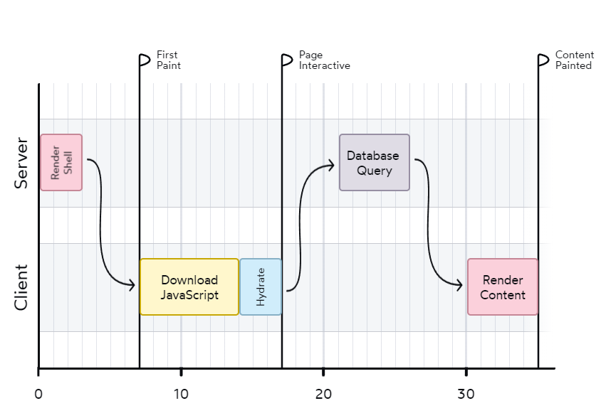
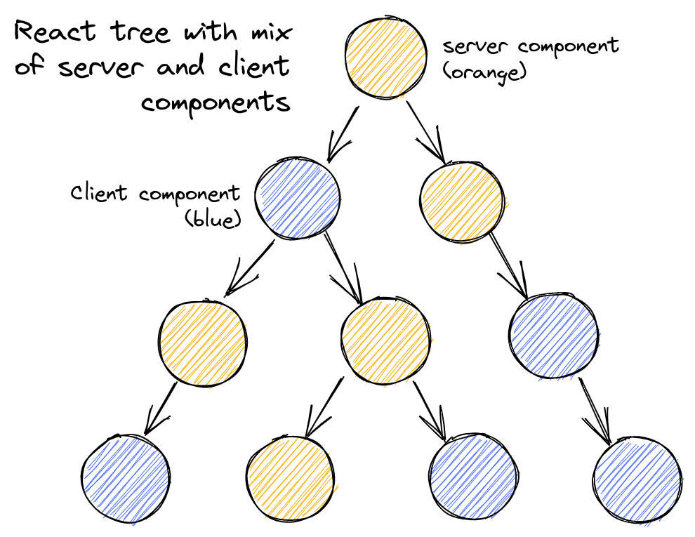
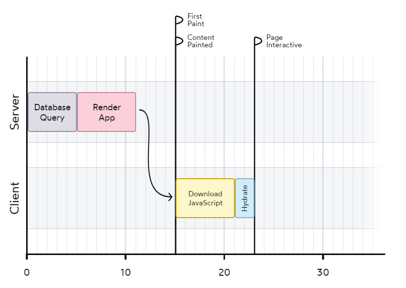
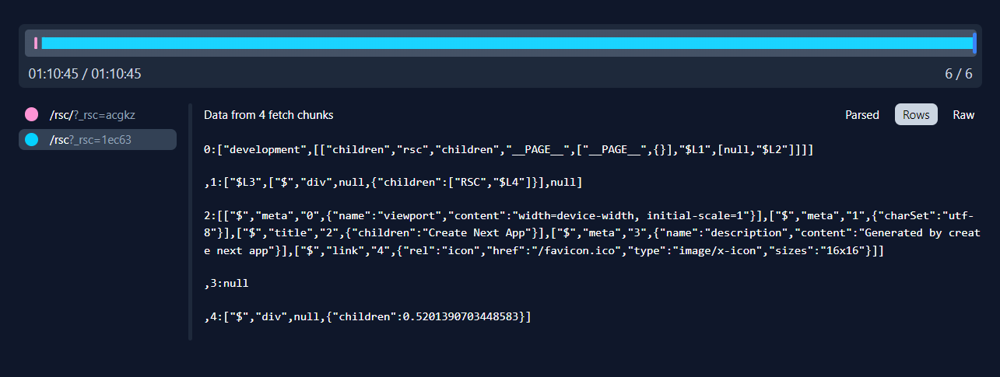

# React Server Component

## 前言

前段时间在看到一个关于 Next.js 的梗，大家看下能不能看懂这个梗~

<div style="display: flex; height: 400px;">
  
  
</div>

如果大家还没有接触过 Next.js，那么可能对这个梗不太熟悉。Next.js 集成了许多 React 的最新特性，比如这张图所指的特性 -- server action。这些特性都与 React Server Components（RSC）这个概念紧密相关，因此，本文将以 RSC 为主线来探讨这些特性。

实际上，RSC 这个概念早在两年前就由 React 团队提出，但一直处于实验阶段。在 React 官网上，我们可以找到许多带有实验标识的 API。然而，我们目前还不能直接使用这些特性，而需要借助其他框架，例如 Next.js。Next.js v14 几乎完全支持这些新特性，而且它还是 React 官方推荐的框架之一。

由于平时我们接触服务端渲染的机会有限，相信大家对 React 的这些新内容还比较陌生。最近我用 Next.js 开发了组件库管理平台，也踩了许多坑，也学到了很多相关知识。所以，希望通过学习 RSC 来帮助大家更好地理解 React 的新特性。同时，也帮助大家理解最开始的那张图的梗。

## 为什么有 RSC？

在了解 RSC 之前，我们应该问一下为什么会有这个概念？也就是说，现在的 React 团队现在是遇到了什么问题才会需要另一个概念来解决这个问题呢？这就要从前端渲染来讲起了。

首先，我们要先认识几个前端性能相关的概念：

- Time to First Byte (TTFB): 第一个字节到达客户端的时间
- First Contentful Paint (FCP): 首屏内容渲染完成的时间
- Time to Interactive (TTI): 可交互的时间

其中 FCP/TTI 是两个比较关键的指标，FCP 对应于首屏白屏的时间，TTI 对于于用户可交互的时间，它们能够直接影响到用户的访问页面的实际体验。

接下来我们看一下常见的网页渲染方式：

### 客户端渲染

客户端渲染 (Client Side Rendering 简称 CSR) 是指在浏览器端使用 JavaScript 渲染页面。我们平常开发的 SPA 应用就是典型的客户端渲染。当用户请求页面时，会返回类似以下的内容：

```html
<!DOCTYPE html>
<html>
  <body>
    <div id="root"></div>
    <!-- bundle.js 包含执行 React 的 root.render 方法，将节点挂在到 root 上 -->
    <script src="/static/js/bundle.js"></script>
  </body>
</html>
```

其中，bundle.js 里面包含了所有的 React 代码，包括 React、其他第三方依赖，以及我们自己写的代码。当浏览器下载并解析完 bundle.js 后，React 开始工作，渲染出整个应用的 DOM 结构，然后挂载到空的 #root 节点上。


整个流程如图所示，这里就存在两个问题：

问题一：需要一定的时间来下载所有的 js 并完成所有的渲染工作。而在这个过程中，用户只能看到一个空白的白屏。随着应用功能的增加，`bundle.js` 的体积也会越来越大，导致用户等待的时间越来越长，十分影响用户的使用体验。

问题二：客户端渲染的数据通常都在 componentDidMount 的生命周期中发起的，这种方式很容易造成 [network waterfalls](https://react.dev/reference/react/useEffect#what-are-good-alternatives-to-data-fetching-in-effects)，比如：

```jsx
<Parent> // useEffect 里发送请求
  <Child> // useEffect 里发送请求
    <GrandChild /> // useEffect 里发送请求
  </Child>
</Parent>
```

整个请求数据的过程是串行的：

```jsx
... => 渲染 Parent 组件 => 获取 Parent 组件数据 => 渲染 Child 组件 => 获取 Child 组件数据 => ...
```

如果父组件的数据请求时间很长，那么子组件的渲染就会被阻塞，导致页面完全渲染出来的时间边长。

如果想要将数据改为并行的，那么就需要将 Child / GrandChild / ... 的数据请求提取到最上层的 Parent 组件中，这样又会导致代码的维护成本增加。

> React 官方不推荐直接在 useEffect 中请求数据，而是使用 swr 库或 Next.js 等框架自带的请求方法代替。

那么，该如何解决这两个问题呢？服务端渲染（with dydration） 在一定程度上解决了这两个问题。

### 服务端渲染

服务端渲染（Server Side Rendering 简称 SSR），是指在服务端生成 HTML 页面。

当用户请求页面时，服务端会根据请求的 URL，获取相应的数据，然后将数据和 HTML 模板结合，渲染出 HTML 页面，最后返回给客户端。客户端拿到 HTML 页面后，直接展示给用户。

但是，单纯的服务端渲染并不利于我们实现动态交互。同时，每个页面都是单独生成的，在页面间跳转时每次都会刷新界面。为了解决这些问题，SSR 通常会配合 CSR 一起使用，也就是同构渲染——同一套代码在服务端和客户端运行。为方便起见，本文后续所指的 SSR 都是指带有 Hydration 的 SSR。同构渲染的流程是：

当用户请求页面时，服务端将 React 代码生成静态的 HTML 返回给用户。如 React.renderToString(<App />) 可以将 App 组件直接转换成 HTML 字符串。由于服务端是没有浏览器环境的，所以 React 的事件是没法绑定到 html 上的。因此，用户首次拿到的 HTML 是 “干巴巴” 的。

```html
<!DOCTYPE html>
<html>
  <body>
    <div id="root">
       <!-- 这里是服务端用 renderToString 将 App 生成的 HTML 字符串 -->
    </div>
    <!-- client.js 包含客户端的水合过程，使用 root.hydrate 方法为 HTML 注入交互事件 -->
    <script src="/static/js/client.js"></script>
  </body>
</html>
```

当用户拿到服务端传回的 HTML 后，React 开始将事件绑定到 HTML 上，同时由客户端接管渲染。React 也提供了相应的方法，如 root.hydrate(<App />)。这个过程也被称为水合（Hydration），用 Dan 的一句话能很好地解释这个名字的来源：

> Hydration is like watering the “dry” HTML with the “water” of interactivity and event handlers.

这里的 root.hydrate 和 root.render 十分的相似。区别就在于 root.hydrate 会复用服务端生成的 html 字符串，以确保在客户端加载时保持与服务器渲染的HTML的一致性，从而提供更好的性能和用户体验。

对于 SSR 来讲，它在服务端和客户端的流程图如下：



可以看出，由于 SSR 会优先返回一个静态的 HTML，让 FCP 时间减少，能够有效地解决白屏问题。而对于数据问题，服务端渲染也提供了一些解决方案，如果了解服务端渲染的同学应该知道，服务端渲染一般会提供一些类似 getServerSideProps / getInitialProps 的方法，用于提前获取数据，如：

``` tsx
export default function Post({ data }) {
  return data.map((item: unknown) => item)
}

Post.getInitialProps = async () => {
  return await fetchData()
}
```

通过这些静态方法的提供，服务端可以在生成 html 的时候提前获取一些组件内部需要到的数据，这样就使得客户端时间请求数据的数量减少，能一定程度上降低数据请求瀑布流的问题。

### 仍存在的问题？

1. SSR 虽然解决了白屏问题，但是 js 的大小并没有减小。当 hydrate 的时候，其实有许多的节点是没有交互的，那么这部分节点实际上是没有必要去 hydrate 的。多余的 js 的加载和执行都是对性能和体验产生影响的。
2. SSR 在服务端请求数据时，只有页面级别的数据静态请求，对于组件级别的数据请求无能为力。同时，页面级别的数据请求会让代码的可维护性降低。

基于上面的问题，以及一些其他层面的考虑，为了能给用户更好的用户体验、更高的性能网页，React 团队在两年前提出了 RSC 的概念，并最终在 Next.js 中落地。

## 什么是 RSC ?

React Server Component 是 React 团队提出的一个新的概念，它是一种新的组件，只会在服务端运行。与之对应的就是 React Client Component，所有我们以前熟知的 React 组件，不管是 CSR，还是 SSR，都是 React Client Component。

以前的心智模型：


新的心智模型：


那为什么需要区分这两种类型的组件呢？

对于一个 React 组件来讲，通常可以分为两种：有交互状态的组件和无交互状态的组件。

- 对于有交互状态的组件由于它需要处理各种前端交互，放在前端比较合适，
- 对于无交互状态的组件，是完全可以在服务端提前渲染完成的。如果该组件还包含数据请求，那么在服务端渲染的话，不计可以节省 js 代码的传输量，同时还能节省数据请求的时间。

因此，对于这类无交互的状态的组件，我们更倾向于将其都移动到服务端进行渲染，也就是我们所讲的 RSC。而对于有交互状态的组件，我们将其放到客户端渲染，也就是称为 RCC。


这里和 [孤岛架构](https://jasonformat.com/islands-architecture/) 非常的像，我们可以把带有交互状态的组件看做静态页面（海洋）中一个个分割的应用（孤岛）。

## RSC 的使用

接下来，让我们看一下 RSC 是怎么使用，这里以 Next.js 为例：

```tsx
'use server'

import db from 'db'

export default async function RSC() {
  const data = await db.query()
  return <div>{data}</div>
}
```

首先，所有文件顶部以 use server 开头的文件都是 RSC。在 Next.js14 中，默认情况下所有组件都是 RSC，而 RCC 需要通过在文件顶部使用 use client 进行标识。当所有组件都标记完成后，就有了以下的 React 节点结构：



其次，RSC 函数可以是异步的形式，并且可以直接访问服务端的任何内容。那这里的 loading 和 error 状态如何处理呢？Next.js 通过特定的文件名配合 Suspense 来处理，比如 error.tsx 对应于请求处理出错的情况，而 loading.tsx 对应于请求中的状态。

但是 RSC 也有一定的限制。由于 RSC 只在服务端渲染，那么它是无法访问客户端相关的 API 的。另外，就像我们在 SSR 里提到的，在服务端渲染的字符串是没有交互的，需要客户端 hydrate 才有交互。那么，对于 RSC 来讲它是没有 hooks，比如 useState/useEffect 都是不支持的。

## RSC 的好处

现在，我们对 RSC 有了初步的了解，再回到 SSR 中的两个问题，看一看 RSC 有什么好处。

### No Client-Server Waterfalls

还记得我们最开始数据请求和渲染的瀑布流问题吗？当将客户端组件改为 RSC 后，组件完全在服务端渲染，数据也是直接在服务端获取，避免了数据在客户端-服务端之间传输的耗时。

另一方面，对于 RSC，由于我们已经将它们都标识出来了，并且它们都是静态的，那么我们可以通过并行的方式对所有 RSC 进行数据请求和渲染。在很大程度上解决了服务端-客户端间数据传输的瀑布流。

使用 RSC 前：

```jsx
// 串行：客户端和服务端直接来回请求数据
... => 渲染 Parent 组件 => 获取 Parent 组件数据 => 渲染 Child 组件 => 获取 Child 组件数据 => ...
```

使用 RSC 后：

```jsx
// 并行：将生成的结果一并回传给客户端
...
获取 Parent 组件数据 => 渲染 Parent 组件 
获取 Child 组件数据  => 渲染 Child 组件
获取 Child 组件数据  => 渲染 Child 组件
...
```

对于用户而言，可以更快的看到地看到完整的网页内容。

### Zero-Bundle-Size Components

对于客户端组件而言，经常会面临第三方包体积过大的问题。比如下面这个例子：

```tsx
import marked from 'marked'; // 35.9K (11.2K gzipped)
import sanitizeHtml from 'sanitize-html'; // 206K (63.3K gzipped)

function NoteWithMarkdown({text}) {
  const html = sanitizeHtml(marked(text));
  return (/* render */);
}
```

打包后，在客户端的 bundle.js 中会包含这些第三方包。但是对于 RSC 而言，所有的处理都是在服务端完成，传回给客户端的只是处理后的 html。而这些第三方包都不会在客户端加载，大大减少了客户端加载 js 的体积。这也是为什么 RSC 被称为 Zero-Bundle-Size Components。

### Full Access to the Backend

正如最开始的梗一样，RSC 拥有完整的服务端能力。

### Automatic Code Splitting

在客户端中，我们通常需要 React.lazy 来进行代码分割。在 RSC 中，每一个导入 Client Component 的地方都会被当做潜在的代码分割点。最终的结果是，RSC 让开发人员能够更加专注于编写应用程序代码，而优化操作交给框架去默认处理。

### Avoiding the Abstraction Tax

在 SSR 中我们有提到，某些静态的节点，不应该被 hydration。当我们使用 RSC 后，React 程序能够清晰地知道哪些节点应该被 hydration，而哪些不会被 hydration。因此，对于 RSC，不需要将其要进行 hydration 的代码以抽象语法的形式传给给客户端执行，减少了 js 的体积以及执行时间。

### 小结

再让我们对照一下网页渲染的流程：


RSC 主要是在减少客户端加载的 js 体积，同时减少 hydration，使得 FCP / TTI 更短。另一方面，RSC 将数据提前到服务端，并进行并行请求，缩短了网页完整渲染所需要的事件。

## Next.js 中 RSC 是怎么渲染的？

在了解 RSC 的一些优点后，接下来我们了解下 RSC 是怎么渲染的：

在服务端：

1. React 会将 Server Component 渲染成一种特殊的数据结构，叫做 React Server Component Payload (RSC Payload).
  
2. Next.js 使用 RSC payload 和 客户端组件的 js 代码生成初始的 html 文件（SSR 服务端渲染）

在客户端：

1. 首先显示由 SSR 生成的静态 html。
2. 使用 RSC Payload 协调 Server Component 和 Client Component 更新 DOM
3. 对 Client Componet 进行 hydate 添加交互事件。

> RSC Payload 是一种特殊的数据结构，用于 React 服务端和客户端间的传输。这种数据结构目前还处于未稳定的状态，没有相关官方文档对其进行说明。
> RSC payload 的具体数据结构可以通过 [RSC DevTools](https://chrome.google.com/webstore/detail/rsc-devtools/jcejahepddjnppkhomnidalpnnnemomn) 插件预览。

当页面跳转时，客户端会获取新页面对应的 RSC Payload，然后通过该新 Payload 进行渲染更新。这样的话，每个页面只需要加载当前页面的内容即可，不需要像 SSR 那样在客户端完全由 CSR 接管，从而带来的代价就是要加载所有的 js 代码。

## 一些概念的澄清

### RSC 和 SSR 的关系

RSC 和 SSR 是互补的关系。RSC 是只在服务端渲染的组件，它传递给客户端的是一种特殊的数据结构，客户端再解析这种数据结构将其渲染成 HTML。所以，RSC 其实也是不利于 SEO 的。所以，我们可以利用 SSR 做首屏白屏优化，而 RSC 做后续的 hydration 和 页面调整更新等等。

### 客户端组件只在客户端渲染吗？

React Server/Client Component 不是物理意义上的服务端和客户端，而是 React 自身对组件新的定义：


可以，看出客户端渲染，为了解决首屏白屏问题，也会在服务端进行渲染。

## React API 预览

- 指令
  - use server：用作标识服务端组件和 server action
  - use client：用于标识客户端组件

- 组件
  - form：定制 action 函数，让其能够支持函数，与 server action 整合

- api
  - cache：为 RSC 缓存请求数据

- hooks
  - use：用于发送请求，配合 Suspense 使用。也能用于 Context 的获取。
  - useOptimistic：乐观更新 UI，类似于 swr，能够在异步操作未完成前假设该操作已成功。
  - useFormState：配合 server action，用于获取 Form 的 state。
  - useFormStatus：配合 server action，用于获取 Form 的状态

## 对新 API 的一些看法

- React 本身
  - 内部引入了"指令"，需要通过 Webpack 或其他打包工具支持，使用时需要外部整合。感觉 React 将更倾向于作为基础库而非开箱即用的框架，供其他上层框架进行封装。

- 开发体验
  - 开发上手难度增加了许多，需要熟悉 Next.js 的各种特性。
  - 对于 RCC 较多的场景，RSC 和 RCC 的区分心智负担较大，时常需要考虑如何去组织组件之间的关系。
  - 目前还不是很成熟，从 Next.js 2w issue 可见其存在的问题，实际开发时也同样有所体会。

- 代码维护性
  - 采用服务端和客户端一体的方式是否更易维护？

## 扩展阅读

### 流式渲染

- [New Suspense SSR Architecture in React 18](https://github.com/reactwg/react-18/discussions/37)
- [React Streaming SSR 原理解析](https://juejin.cn/post/7165699863416406029)
- [浅析React 18 Streaming SSR（流式服务端渲染）](https://juejin.cn/post/7064759195710521381)

### PPR

- [Building towards a new default rendering model for web applications](https://vercel.com/blog/partial-prerendering-with-next-js-creating-a-new-default-rendering-model)
- [The case of partial hydration (with Next and Preact)](https://medium.com/@luke_schmuke/how-we-achieved-the-best-web-performance-with-partial-hydration-20fab9c808d5)

### 孤岛组件

- [Rendering on the Web: Performance Implications of Application Architecture (Google I/O ’19)](https://www.youtube.com/watch?v=k-A2VfuUROg)
- [Islands Architecture](https://jasonformat.com/islands-architecture/)
- [Islands 架构原理和实践](https://juejin.cn/post/7155300194773860382)

## 参考内容

### 数据请求问题

- [官方答：在React18中请求数据的正确姿势（其他框架也适用](https://www.51cto.com/article/713024.html)
- [What are good alternatives to data fetching in Effects?](https://react.dev/reference/react/useEffect#what-are-good-alternatives-to-data-fetching-in-effects)

### 性能指标

- [Rendering on the Web](https://web.dev/articles/rendering-on-the-web)

### RSC

- [React Labs: What We've Been Working On – March 2023](https://react.dev/blog/2023/03/22/react-labs-what-we-have-been-working-on-march-2023)
- [Data Fetching with React Server Components](https://www.youtube.com/watch?v=TQQPAU21ZUw&t=446s)
- [RFC: React Server Components](https://github.com/reactjs/rfcs/blob/main/text/0188-server-components.md)
- [Why do Client Components get SSR'd to HTML?](https://github.com/reactwg/server-components/discussions/4)
- [RSC From Scratch. Part 1: Server Components](https://github.com/reactwg/server-components/discussions/5)
- [How React server components work: an in-depth guide](https://www.plasmic.app/blog/how-react-server-components-work)
- [Making Sense of React Server Components](https://www.joshwcomeau.com/react/server-components/)
- [Demystifying React Server Components with NextJS 13 App Router](https://demystifying-rsc.vercel.app/)
- [Everything I wish I knew before moving 50,000 lines of code to React Server Components](https://www.mux.com/blog/what-are-react-server-components)
- [React Server Component 从理念到原理](https://juejin.cn/post/7244452476190752829)

### Server actions

- [use server](https://react.dev/reference/react/use-server)
- [\<form>](https://react.dev/reference/react-dom/components/form)
- [useFormState](https://react.dev/reference/react-dom/hooks/useFormState)
- [useFormStatus](https://react.dev/reference/react-dom/hooks/useFormStatus)
- [Can React Server Actions finally fix forms?](https://www.mux.com/blog/what-are-react-server-actions)
