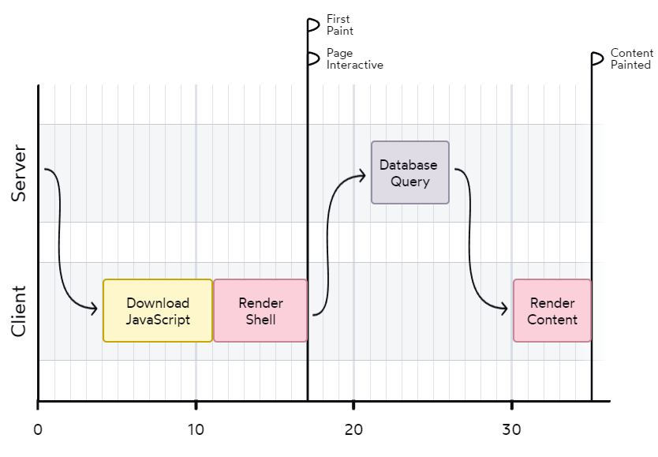

# React Server Component

## 前言

前阵子使用 Next.js 开发了组件库管理平台的前端模块，了解到一个比较新的概念 -- React Server Component（简称 RSC）。这个概念早在两年前 React 团队就提出来了，不过一直是处于试验中的状态，直到 Next.js v13 才被正式整合到实际生产应用环境当中。

由于平时我们接触服务端渲染的机会有限，所以对这方面相关的知识可能就了解得比较少。我在 Next.js 的使用过程中也踩到了许多坑，其中主要的一个问题就是对 RSC 概念了解不是很透彻，这就导致写起代码来比较别扭。

所以，后续我也看了一些相关的文章，借此机会分享一下自己对 RSC 的理解。同时，也希望大家能够借 RSC 这个概念了解一下 React 团队目前在做什么以及 React 的发展方向。毕竟，自 React18 发布之后，React 似乎和我们就断开连接了。

## 为什么有 RSC？

在了解 RSC 之前，我们应该问一下为什么会有这个概念？也就是说，现在的 React 渲染是有什么问题才会需要另一个概念来解决这个问题呢？这就要从前端渲染来讲了。

首先，我们要先认识几个前端性能相关的概念：

- Time to First Byte (TTFB): 第一个字节到达客户端的时间
- First Contentful Paint (FCP): 首屏内容渲染完成的时间
- Time to Interactive (TTI): 可交互的时间

其中 FCP/TTI 是两个比较关键的指标，因为它能够直接影响到用户的访问页面的实际体验。

接下来我们看一下几种渲染方式：

### 服务端渲染（Server Side Rendering 简称 SSR）

服务端渲染简称 SSR（Server Side Rendering），是指在服务端生成 HTML 页面。当用户请求页面时，服务端会根据请求的 URL，获取相应的数据，然后将数据和 HTML 模板结合，渲染出 HTML 页

### 客户端渲染 (Client Side Rendering 简称 CSR)

客户端渲染是指在浏览器端使用 JavaScript 渲染页面。我们平常开发的 SPA 应用就是典型的客户端渲染。当用户请求页面时，会返回类似以下的内容：

```html
<!DOCTYPE html>
<html>
  <body>
    <div id="root"></div>
    <script src="/static/js/bundle.js"></script>
  </body>
</html>
```

其中，`bundle.js` 里面包含了所有的 React 代码，包括 React、其他第三方依赖，以及我们自己写的代码。当浏览器下载并解析完 `bundle.js` 后，React 开始工作，渲染出整个应用的 DOM 结构，然后挂载到空的 `#root` 节点上。



这种方式的问题在于，它需要一定的时间来下载所有的 js 和完成所有的渲染工作。而在这个过程中，用户只能看到一个空白的白屏。随着应用功能的增加，`bundle.js` 的体积也会越来越大，导致用户等待的时间越来越长，十分影响用户的使用体验。

那怎么解决这个问题呢？

### 服务端渲染配合客户端激活（SSR with hydration）

服务端渲染简称 SSR（Server Side Rendering），是指在服务端生成 HTML 页面。当用户请求页面时，服务端会根据请求的 URL，获取相应的数据，然后将数据和 HTML 模板结合，渲染出 HTML 页面，最后返回给客户端。客户端拿到 HTML 页面后，直接展示给用户。


## RSC 是什么，有什么优缺点？


## RSC 如何实现的？

## RSC 怎么使用？

## 基于 RSC 还有那些特性？

 ====================== todo =================

### 目标

- Good User Experience
- Cheap maintenance
- Fast performance

### 数据请求时的问题

``` ts
// 一个三层请求的例子
function Article() {
  return <div>article</div>
}
```

- 如果是是一层一层的请求，会造成瀑布流问题，用户体验不好。
- 如果是一次性请求所有数据，然后一层一层向下传递数据，会让代码变得复杂，不利于代码的维护。

理想的情况下是每个组件有自己的请求，并且不会造成瀑布流问题。

## 渲染指标

- Time to First Byte (TTFB): 第一个字节到达客户端的时间
- First Contentful Paint (FCP): 首屏内容渲染完成的时间
- Largest Contentful Paint (LCP): 最大内容渲染完成的时间
- Time to Interactive (TTI): 可交互的时间

### 服务端渲染（with hydration）

服务端渲染简称 SSR（Server Side Rendering），是指在服务端使用 JavaScript 渲染页面。当用户请求页面时，服务端会根据请求的 URL，获取相应的数据，然后将数据和 HTML 模板结合，渲染出 HTML 页面，最后返回给客户端。客户端拿到 HTML 页面后，直接展示给用户。

```html
<!DOCTYPE html>
<html>
  <body>
    <div id="root">
       <!-- SSR generated code here -->
    </div>
    <script src="/static/js/client.js"></script>
  </body>
</html>
```

整体的流程是：客户端发送请求（client） => 服务端接受请求，生成首屏 html（server）=> 客户端接受 html，并进行 hydrate 操作（client）=> 客户端发送请求，获取数据（client）=> 客户端接受数据，进行渲染（client）

### 不足的地方

- ssr 只存在路由级别的请求，对于组件级别的请求，会由客户端再次发起请求，这样就会出现瀑布流的问题。
- 所有的组件都会在客户端进行 hydrate 操作，即使是没有必要的一些组件，比如一些静态的组件，这样会导致客户端的 js 代码较大以及执行代码消耗的时间增加。

### 比较

- ssr/ssg/isr/ppr  + spa + pre rendering
  - 优点
  - 缺点
    - 还是需要加载所有的客户端代码
    - 瀑布流
- ssr/ssg + spa + rsc
  - 优点
  - 缺点

- next.js ppr(partial prerender)
  - 优点、缺点

## rsc 是什么，解决了什么问题

### 基本原理

- renderToString => hydrate => navigate => fetchRSC => root.render
- 发送请求(client) => 服务端接受请求，生成首屏 html（server）=> 客户端接受 html，并进行 hydrate 操作（client）=> 客户端发送请求，获取 rsc 组件（client）=> 客户端接受 rsc 组件，进行 root.render 操作（client）

## 优点

### Zero-Bundle-Size 组件

- 有完全的服务端能力，离数据源比较近，减少请求时间
- 0 bundled js，第三包不会打包进来，减小包体积，减少传输时间
- 自动代码分割，根据 client/server/suspense 自动分割
- 没有瀑布流，不用等待上层组件
- 减小抽象语法带来的传输消耗，比如以前传输 React.createElement(FunctionComponent)，现在已经打包成 html/rsc 了，体积会减小。
- 同一语言，同一框架。

- 一些概念
  - client component/ server component 不是物理上的 client/server，而是 react 组件内部自己定义的。
  - 以前的组件都是 client component，包括 ssr 渲染的组件，这些组件最终都是会在客户端再次渲染一遍。
  - rsc 组件是新定义的组件，该部分组件其实主要处理的就是没有交互的内容。
  - rsc 是打包后以特定的格式返回到客户端，客户端只需要组合响应的 html 更新即可。
  - rsc 格式实际上是类似于 ReactElement 的一种变体，所以 rsc 其实也是不利于 seo 的。因此 rsc 可以与 ssr 进行配合。ssr 负责首次渲染，rsc 负责静态内容渲染更新。

## 怎么解决的，部分实现原理

- jsx => babel => React.createElement => ReactElement => html

## React api 介绍

- 指令
  - use server
  - use client
  
- hooks
  - use
  - useOptimistic
  - useFormState
  - useFormStatus

- api
  - cache

- 组件
  - form

## Next.js 案例，有哪些不一样的体验，有哪些坑

## 其他人的看法

## 参考内容

### RSC

- [React Labs: What We've Been Working On – March 2023](https://react.dev/blog/2023/03/22/react-labs-what-we-have-been-working-on-march-2023)
- [Data Fetching with React Server Components](https://www.youtube.com/watch?v=TQQPAU21ZUw&t=446s)
- [RFC: React Server Components](https://github.com/reactjs/rfcs/blob/main/text/0188-server-components.md)
- [Why do Client Components get SSR'd to HTML?](https://github.com/reactwg/server-components/discussions/4)
- [RSC From Scratch. Part 1: Server Components](https://github.com/reactwg/server-components/discussions/5)
- [How React server components work: an in-depth guide](https://www.plasmic.app/blog/how-react-server-components-work)
- [Making Sense of React Server Components](https://www.joshwcomeau.com/react/server-components/)
- [Demystifying React Server Components with NextJS 13 App Router](https://demystifying-rsc.vercel.app/)
- [Everything I wish I knew before moving 50,000 lines of code to React Server Components](https://www.mux.com/blog/what-are-react-server-components)

### 流式渲染

- [New Suspense SSR Architecture in React 18](https://github.com/reactwg/react-18/discussions/37)
- [React Streaming SSR 原理解析](https://juejin.cn/post/7165699863416406029)
- [浅析React 18 Streaming SSR（流式服务端渲染）](https://juejin.cn/post/7064759195710521381)

### PPR

- [Building towards a new default rendering model for web applications](https://vercel.com/blog/partial-prerendering-with-next-js-creating-a-new-default-rendering-model)
- [The case of partial hydration (with Next and Preact)](https://medium.com/@luke_schmuke/how-we-achieved-the-best-web-performance-with-partial-hydration-20fab9c808d5)

### 性能指标

- [Rendering on the Web](https://web.dev/articles/rendering-on-the-web)

### 孤岛组件

- [Rendering on the Web: Performance Implications of Application Architecture (Google I/O ’19)](https://www.youtube.com/watch?v=k-A2VfuUROg)
- [Islands Architecture](https://jasonformat.com/islands-architecture/)
- [Islands 架构原理和实践](https://juejin.cn/post/7155300194773860382)

### Server actions

- [use server](https://react.dev/reference/react/use-server)
- [\<form>](https://react.dev/reference/react-dom/components/form)
- [useFormState](https://react.dev/reference/react-dom/hooks/useFormState)
- [useFormStatus](https://react.dev/reference/react-dom/hooks/useFormStatus)
- [Can React Server Actions finally fix forms?](https://www.mux.com/blog/what-are-react-server-actions)
