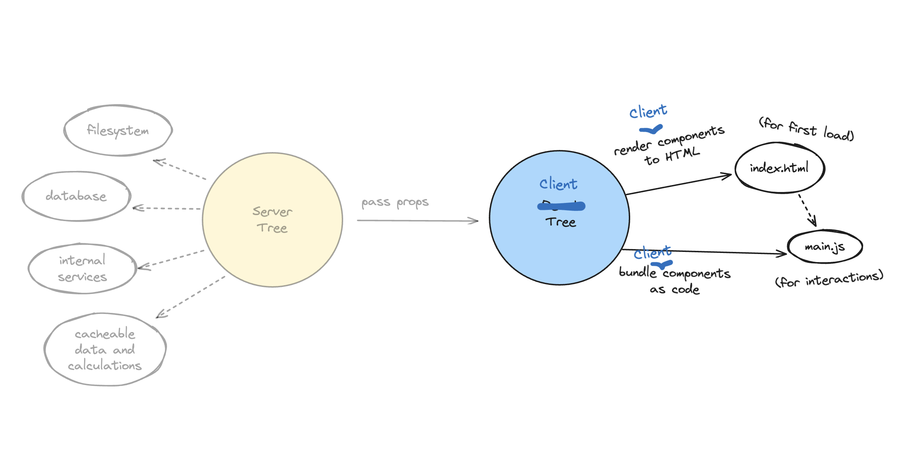
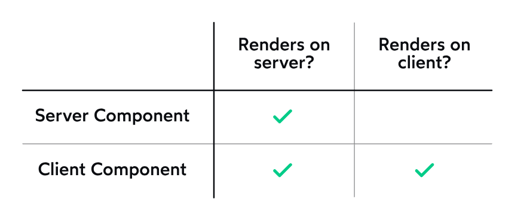

# React Server Component

## 前言

前阵子使用 Next.js 开发了组件库管理平台的前端模块，了解到一个比较新的概念 -- React Server Component（简称 RSC）。这个概念早在两年前 React 团队就提出来了，不过一直是处于试验中的状态，直到 Next.js v13 才被正式整合到实际生产应用环境当中。

由于平时我们接触服务端渲染的机会有限，所以对这方面相关的知识可能就了解得比较少。我在 Next.js 的使用过程中也踩到了许多坑，其中主要的一个问题就是对 RSC 概念了解不是很透彻，这就导致写起代码来比较别扭。

所以，后续我也看了一些相关的文章，借此机会分享一下自己对 RSC 的理解。同时，也希望大家能够借 RSC 这个概念了解一下 React 团队目前在做什么以及 React 的发展方向。毕竟，自 React18 发布之后，React 似乎和我们就断开连接了。

## 为什么有 RSC？

在了解 RSC 之前，我们应该问一下为什么会有这个概念？也就是说，现在的 React 渲染是有什么问题才会需要另一个概念来解决这个问题呢？这就要从前端渲染来讲了。

首先，我们要先认识几个前端性能相关的概念：

- Time to First Byte (TTFB): 第一个字节到达客户端的时间
- First Contentful Paint (FCP): 首屏内容渲染完成的时间
- Time to Interactive (TTI): 可交互的时间

其中 FCP/TTI 是两个比较关键的指标，因为它能够直接影响到用户的访问页面的实际体验。

接下来我们看一下几种渲染方式：

### 客户端渲染

客户端渲染 (Client Side Rendering 简称 CSR) 是指在浏览器端使用 JavaScript 渲染页面。我们平常开发的 SPA 应用就是典型的客户端渲染。当用户请求页面时，会返回类似以下的内容：

```html
<!DOCTYPE html>
<html>
  <body>
    <div id="root"></div>
    <!-- bundle.js 包含执行 React 的 root.render 方法，将节点挂在到 root 上 -->
    <script src="/static/js/bundle.js"></script>
  </body>
</html>
```

其中，`bundle.js` 里面包含了所有的 React 代码，包括 React、其他第三方依赖，以及我们自己写的代码。当浏览器下载并解析完 `bundle.js` 后，React 开始工作，渲染出整个应用的 DOM 结构，然后挂载到空的 `#root` 节点上。


整个流程如图所示，这里就存在两个问题：

问题一：需要一定的时间来下载所有的 js 并完成所有的渲染工作。而在这个过程中，用户只能看到一个空白的白屏。随着应用功能的增加，`bundle.js` 的体积也会越来越大，导致用户等待的时间越来越长，十分影响用户的使用体验。

问题二：客户端渲染的数据通常都在 componentDidMount 的生命周期中发起的，这种方式很容易造成 [network waterfalls](https://react.dev/reference/react/useEffect#what-are-good-alternatives-to-data-fetching-in-effects)，比如：

```jsx
<Parent> // useEffect 里发送请求
  <Child> // useEffect 里发送请求
    <GrandChild /> // useEffect 里发送请求
  </Child>
</Parent>
```

整个请求数据的过程是串行的：

```jsx
... => 渲染 Parent 组件 => 获取 Parent 组件数据 => 渲染 Child 组件 => 获取 Child 组件数据 => ...
```

如果父组件的数据请求时间很长，那么子组件的渲染就会被阻塞，导致页面完全渲染出来的时间边长。

如果想要将数据改为并行的，那么就需要将 Child / GrandChild / ... 的数据请求提取到最上层的 Parent 组件中，这样又会导致代码的维护成本增加。

> React 官方不推荐直接在 useEffect 中请求数据，而是使用 swr 库或 Next.js 等框架自带的请求方法代替。

那么，该如何解决这两个问题呢？服务端渲染（with dydration） 在一定程度上解决了这两个问题。

### 服务端渲染

服务端渲染（Server Side Rendering 简称 SSR），是指在服务端生成 HTML 页面。

当用户请求页面时，服务端会根据请求的 URL，获取相应的数据，然后将数据和 HTML 模板结合，渲染出 HTML 页面，最后返回给客户端。客户端拿到 HTML 页面后，直接展示给用户。

但是，单纯的服务端渲染并不利于我们实现动态交互。同时，每个页面都是单独生成的，在页面间跳转时每次都会刷新界面。为了解决这些问题，SSR 通常会配合 CSR 一起使用，也就是同构渲染——同一套代码在服务端和客户端运行。为方便起见，本文后续所指的 SSR 都是指带有 Hydration 的 SSR。同构渲染的流程是：

当用户请求页面时，服务端将 React 代码生成静态的 HTML 返回给用户。如 React.renderToString(<App />) 可以将 App 组件直接转换成 HTML 字符串。由于服务端是没有浏览器环境的，所以 React 的事件是没法绑定到 html 上的。因此，用户首次拿到的 HTML 是 “干巴巴” 的。

```html
<!DOCTYPE html>
<html>
  <body>
    <div id="root">
       <!-- 这里是服务端用 renderToString 将 App 生成的 HTML 字符串 -->
    </div>
    <!-- client.js 包含客户端的水合过程，使用 root.hydrate 方法为 HTML 注入交互事件 -->
    <script src="/static/js/client.js"></script>
  </body>
</html>
```

当用户拿到服务端传回的 HTML 后，React 开始将事件绑定到 HTML 上，同时由客户端接管渲染。React 也提供了相应的方法，如 root.hydrate(<App />)。这个过程也被称为水合（Hydration），用 Dan 的一句话能很好地解释这个名字的来源：

> Hydration is like watering the “dry” HTML with the “water” of interactivity and event handlers.

这里的 root.hydrate 和 root.render 十分的相似。区别就在于 root.hydrate 会复用服务端生成的 html 字符串，以确保在客户端加载时保持与服务器渲染的HTML的一致性，从而提供更好的性能和用户体验。

对于 SSR 来讲，它在服务端和客户端的流程图如下：


可以看出，由于 SSR 会优先返回一个静态的 HTML，让 FCP 时间减少，能够有效地解决白屏问题。而对于数据问题，服务端渲染也提供了一些解决方案，如果了解服务端渲染的同学应该知道，服务端渲染一般会提供一些类似 getServerSideProps / getInitialProps 的方法，用于提前获取数据，如：

``` tsx
export default function Post({ data }) {
  return data.map((item: unknown) => item)
}

Post.getInitialProps = async () => {
  return await fetchData()
}
```

通过这些静态方法的提供，服务端可以在生成 html 的时候提前获取一些组件内部需要到的数据，这样就使得客户端时间请求数据的数量减少，能一定程度上降低数据请求瀑布流的问题。

### 仍存在的问题？

1. SSR 虽然解决了白屏问题，但是 js 的大小并没有减小。当 hydrate 的时候，其实有许多的节点是没有交互的，那么这部分节点实际上是没有必要去 hydrate 的。多余的 js 的加载和执行都是对性能和体验产生影响的。
2. SSR 在服务端请求数据时，只有页面级别的数据静态请求，对于组件级别的数据请求无能为力。同时，页面级别的数据请求会让代码的可维护性降低。

基于上面的问题，以及一些其他层面的考虑，为了能给用户更好的用户体验、更高的性能网页，React 团队在两年前提出了 RSC 的概念，并最终在 Next.js 中落地。

## 什么是 RSC ?

React Server Component 是 React 团队提出的一个新的概念，它是一种新的组件，只会在服务端运行。与之对应的就是 React Client Component，所有我们以前熟知的 React 组件，不管是 CSR，还是 SSR，都是 React Client Component。

以前的心智模型：


新的心智模型：


那为什么需要区分这两种类型的组件呢？

对于一个 React 组件来讲，通常可以分为两种：有交互状态的组件和无交互状态的组件。

- 对于有交互状态的组件由于它需要处理各种前端交互，放在前端比较合适，
- 对于无交互状态的组件，是完全可以在服务端提前渲染完成的。如果该组件还包含数据请求，那么在服务端渲染的话，不计可以节省 js 代码的传输量，同时还能节省数据请求的时间。

因此，对于这类无交互的状态的组件，我们更倾向于将其都移动到服务端进行渲染，也就是我们所讲的 RSC。而对于有交互状态的组件，我们将其放到客户端渲染，也就是称为 RCC。


这里和 [孤岛架构](https://jasonformat.com/islands-architecture/) 非常的像，我们可以把带有交互状态的组件看做静态页面（海洋）中一个个分割的应用（孤岛）。

## RSC 的使用

接下来，让我们看一下 RSC 怎么使用，这里以 Next.js 为例：

```tsx
'use server'

import db from 'db'

export default async function RSC() {
  const data = await db.query()
  return <div>{data}</div>
}
```

首先，所有文件顶部以 use server 开头的文件都是 RSC。在 Next.js14 中，默认情况下所有组件都是 RSC，而 RCC 需要使用 use client 进行标识。

其次，RSC 函数可以是异步的形式，并且可以直接访问服务端的任何内容。

需要注意的是，RSC 在服务端渲染的组件，那么它是无法访问客户端相关的 API 的。另外，就像我们在 SSR 里提到的，在服务端渲染的字符串是没有交互的，需要客户端 hydrate 才有交互。那么，对于 RSC 来讲它是没有 hooks，比如 useState/useEffect 都是不支持的。


### RSC 是怎么渲染的？

### RSC 
React Server/Client Component 并不是物理意义上的服务端和客户端，而是 React 自身对组件新的定义：




### 比较

- ssr/ssg/isr/ppr  + spa + pre rendering
  - 优点
  - 缺点
    - 还是需要加载所有的客户端代码
    - 瀑布流
- ssr/ssg + spa + rsc
  - 优点
  - 缺点

- next.js ppr(partial prerender)
  - 优点、缺点

## rsc 是什么，解决了什么问题

### 基本原理

- renderToString => hydrate => navigate => fetchRSC => root.render
- 发送请求(client) => 服务端接受请求，生成首屏 html（server）=> 客户端接受 html，并进行 hydrate 操作（client）=> 客户端发送请求，获取 rsc 组件（client）=> 客户端接受 rsc 组件，进行 root.render 操作（client）

## 优点

### Zero-Bundle-Size 组件

- 有完全的服务端能力，离数据源比较近，减少请求时间
- 0 bundled js，第三包不会打包进来，减小包体积，减少传输时间
- 自动代码分割，根据 client/server/suspense 自动分割
- 没有瀑布流，不用等待上层组件
- 减小抽象语法带来的传输消耗，比如以前传输 React.createElement(FunctionComponent)，现在已经打包成 html/rsc 了，体积会减小。
- 同一语言，同一框架。

- 一些概念
  - client component/ server component 不是物理上的 client/server，而是 react 组件内部自己定义的。
  - 以前的组件都是 client component，包括 ssr 渲染的组件，这些组件最终都是会在客户端再次渲染一遍。
  - rsc 组件是新定义的组件，该部分组件其实主要处理的就是没有交互的内容。
  - rsc 是打包后以特定的格式返回到客户端，客户端只需要组合响应的 html 更新即可。
  - rsc 格式实际上是类似于 ReactElement 的一种变体，所以 rsc 其实也是不利于 seo 的。因此 rsc 可以与 ssr 进行配合。ssr 负责首次渲染，rsc 负责静态内容渲染更新。

## 怎么解决的，部分实现原理

- jsx => babel => React.createElement => ReactElement => html

## React api 介绍

- 指令
  - use server
  - use client
  
- hooks
  - use
  - useOptimistic
  - useFormState
  - useFormStatus

- api
  - cache

- 组件
  - form

## Next.js 案例，有哪些不一样的体验，有哪些坑

## 其他人的看法

## 参考内容

### 数据请求问题

- [官方答：在React18中请求数据的正确姿势（其他框架也适用](https://www.51cto.com/article/713024.html)
- [What are good alternatives to data fetching in Effects?](https://react.dev/reference/react/useEffect#what-are-good-alternatives-to-data-fetching-in-effects)

### RSC

- [React Labs: What We've Been Working On – March 2023](https://react.dev/blog/2023/03/22/react-labs-what-we-have-been-working-on-march-2023)
- [Data Fetching with React Server Components](https://www.youtube.com/watch?v=TQQPAU21ZUw&t=446s)
- [RFC: React Server Components](https://github.com/reactjs/rfcs/blob/main/text/0188-server-components.md)
- [Why do Client Components get SSR'd to HTML?](https://github.com/reactwg/server-components/discussions/4)
- [RSC From Scratch. Part 1: Server Components](https://github.com/reactwg/server-components/discussions/5)
- [How React server components work: an in-depth guide](https://www.plasmic.app/blog/how-react-server-components-work)
- [Making Sense of React Server Components](https://www.joshwcomeau.com/react/server-components/)
- [Demystifying React Server Components with NextJS 13 App Router](https://demystifying-rsc.vercel.app/)
- [Everything I wish I knew before moving 50,000 lines of code to React Server Components](https://www.mux.com/blog/what-are-react-server-components)
- [React Server Component 从理念到原理](https://juejin.cn/post/7244452476190752829)

### 流式渲染

- [New Suspense SSR Architecture in React 18](https://github.com/reactwg/react-18/discussions/37)
- [React Streaming SSR 原理解析](https://juejin.cn/post/7165699863416406029)
- [浅析React 18 Streaming SSR（流式服务端渲染）](https://juejin.cn/post/7064759195710521381)

### PPR

- [Building towards a new default rendering model for web applications](https://vercel.com/blog/partial-prerendering-with-next-js-creating-a-new-default-rendering-model)
- [The case of partial hydration (with Next and Preact)](https://medium.com/@luke_schmuke/how-we-achieved-the-best-web-performance-with-partial-hydration-20fab9c808d5)

### 性能指标

- [Rendering on the Web](https://web.dev/articles/rendering-on-the-web)

### 孤岛组件

- [Rendering on the Web: Performance Implications of Application Architecture (Google I/O ’19)](https://www.youtube.com/watch?v=k-A2VfuUROg)
- [Islands Architecture](https://jasonformat.com/islands-architecture/)
- [Islands 架构原理和实践](https://juejin.cn/post/7155300194773860382)

### Server actions

- [use server](https://react.dev/reference/react/use-server)
- [\<form>](https://react.dev/reference/react-dom/components/form)
- [useFormState](https://react.dev/reference/react-dom/hooks/useFormState)
- [useFormStatus](https://react.dev/reference/react-dom/hooks/useFormStatus)
- [Can React Server Actions finally fix forms?](https://www.mux.com/blog/what-are-react-server-actions)
