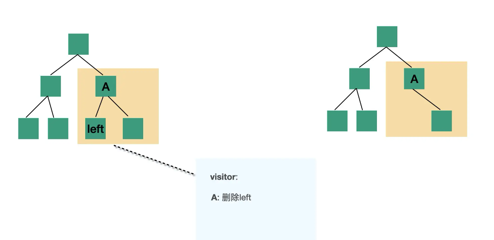

# 概览

## 作用
babel 是一个代码转译工具，专门用于 js 相关的代码转换。虽然平时开发中很少会直接使用 babel 去进行代码转换，但是代码转换这个过程却存在前端日常开发的各个环节，比如：

  - ts/react，jsx/vue，template/esnext 等语法转换到目标环境的代码，支持我们用高级语法去开发项目。
  -  lint 工具对代码进行规范化，减少格式化问题。
  - 按需加载、tree shaking、代码压缩等，优化代码体积。
  - 自动国际化、自动埋点等。
  - …

因此，熟悉 babel 的工作原理，对于我们日常开发是非常有帮助的。

## 流程

  - parse：将源码转换为抽象语法树（AST）。
  - transform：遍历 AST，通过各种插件修改 AST。
  - generate：根据新的 AST 生成目标代码，并生产 sourcemap。

   

### parse 阶段

parse 阶段将源码转换为抽象语法树主要包含两部分，以 let name = “guang” 为例：

  - 词法分析：首先会将源码解析为 let，name， = ， “guang” 一个个的 token。
  - 语法分析：将生成的 token 进行组装，生成 AST。

  

通俗来讲，parse 过程相当于将字符串解析成树结构，这个树结构能够表示源码的语法信息。 我们可以通过 [ast explorer](https://astexplorer.net/) 网站查看解析后的 AST，如果想要了解具体如何解析为AST的，可以看看 [vue 对模板中 html 的解析过程](https://github.com/vuejs/core/blob/main/packages/compiler-core/src/parse.ts)。

babel 将 parse 过程封装成了 @babel/parser 库，如：

```js
import { parse } from '@babel/parser'
const source = 'const a = 1'
const ast = parse(source)
```

### transform 阶段

transform 阶段将 parse 阶段得到的 AST 进行转换，此时会遍历 AST，然后通过 visitor 对 AST 进行修改，返回新的 AST。



babel 将遍历的过程封装成了 @babel/traverse 库，专门用于遍历 AST。比如：
```js
import { parse } from '@babel/parser'
import traverse from '@babel/traverse'

const source = 'const a = 1'
const ast = parse(source)

traverse(ast, {
  enter(path, state) {
    if (path.node.type === 'VariableDeclaration')
      path.node.kind = 'var'
  },
})
```

### generate 阶段
当 AST 修改完成后，就可以遍历新的 AST 生成目标代码，该过程在 babel 中对应 @babel/generator 库：
```js
import generator from '@babel/generator'

const { code, map } = generator(ast, {
  sourceMaps: true,
})

// 经过转换后生成的目标代码为为：
// var a = 1;
```

由于 ast 转换前后都记录了每个 token 在文件中的具体位置，在生成代码的时候可以生成 sourcemap，记录代码生成前和生产后的token 之间的映射关系，从而方便我们快速定位源代码位置。对 sourcemap 的生成原理感兴趣的话可以看看 [这篇文章](https://juejin.cn/post/7071193028051861518)，比较有意思。

## 工具库

babel 的工作流程已经比较清晰，上面也介绍了一些 babel 相关的库，总结一下 babel 的一些基础工具库：

  - @babel/parser：用于将代码解析成 AST。
  - @babel/traverse：用于遍历 AST。
  - @babel/types：用于遍历时判断 AST 节点类型，创建AST节点等。
  - @babel/template：根据模板快速生成对应的 AST。
  - @babel/generator：将 AST 生成为目标代码，并生成 sourcemap。
  - @babel/core：将 parse，traverse，generator流程整合在一起，并且实现了插件机制，允许外部控制代码转换过程。
  - @babel/code-frame：用于解析出错时生成一些标记错误位置信息的代码。类似于 vscode eslint 报错位置信息。
  - @babel/helper-module-imports：用于在 AST 中添加 import 语句。
