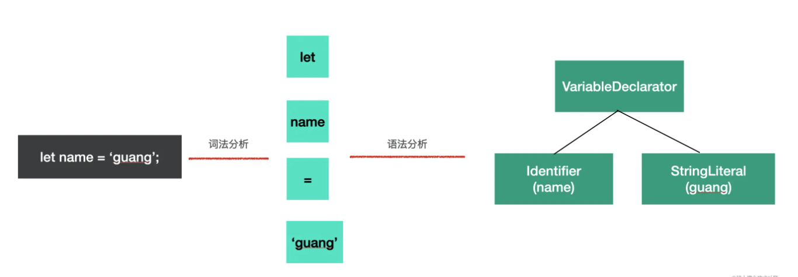

# Babel 入门

## 前言


但是为什么需要这么改呢？这里就涉及一些 babel 相关的知识。

相信大家对 babel 这个词都比较熟悉，babel 是一个代码转译工具，专门用于 js 相关的代码转换。 虽然平时开发中很少会直接使用 babel 去进行代码转换，但是代码转换这个过程却存在前端日常开发的各个环节，比如：

- ts/react jsx/vue template/esnext 等语法转换到目标环境的代码，支持我们用高级语法去开发项目。
-  lint 工具对代码进行规范化，减少格式化问题。
- 按需加载、tree shaking、代码压缩等，优化代码体积。
- 自动国际化、自动埋点等。
- …

因此，这次主要分享 babel 的一些基本内容，包括使用、原理、插件等，帮助我们更好地理解上面这些与前端开发息息相关的内容，也帮助我们更好地去解决一些代码转换相关的实际问题。本文组织内容如下：


## 工作流程

babel 的整体流程包含三步：

- parse：将源码转换为抽象语法树（AST）。

- transform：遍历 AST，通过各种插件修改 AST。

- generate：根据新的 AST 生成目标代码，并生产 sourcemap。

   


### parse

parse 阶段将源码转换为抽象语法树主要包含两部分，以 let name = “guang” 为例：

- 词法分析：首先会将源码解析为 let，name， = ， “guang” 一个个的 token。

- 语法分析：将生成的 token 进行组装，生成 AST。

  

通俗来讲，parse 过程相当于将字符串解析成树结构，这个树结构能够表示源码的语法信息。 我们可以通过 [ast explorer](https://astexplorer.net/) 网站查看解析后的 AST，如果想要了解具体如何解析为AST的，可以看看 [vue 对模板中 html 的解析过程](https://github.com/vuejs/core/blob/main/packages/compiler-core/src/parse.ts)。

babel 将 parse 过程封装成了 @babel/parser 库，如：

```js
import { parse } from '@babel/parser'
const source = 'const a = 1'
const ast = parse(source)

// 解析出来的 AST 为
Node {
  "comments": [],
  "end": 11,
  "errors": [],
  "loc": SourceLocation {
    "end": Position {
      "column": 11,
      "index": 11,
      "line": 1,
    },
    "filename": undefined,
    "identifierName": undefined,
    "start": Position {
      "column": 0,
      "index": 0,
      "line": 1,
    },
  },
  "program": Node {
    "body": [
      Node {
        "declarations": [
          Node {
            "end": 11,
            "id": Node {
              "end": 7,
              "loc": SourceLocation {
                "end": Position {
                  "column": 7,
                  "index": 7,
                  "line": 1,
                },
                "filename": undefined,
                "identifierName": "a",
                "start": Position {
                  "column": 6,
                  "index": 6,
                  "line": 1,
                },
              },
              "name": "a",
              "start": 6,
              "type": "Identifier",
            },
            "init": Node {
              "end": 11,
              "extra": {
                "raw": "1",
                "rawValue": 1,
              },
              "loc": SourceLocation {
                "end": Position {
                  "column": 11,
                  "index": 11,
                  "line": 1,
                },
                "filename": undefined,
                "identifierName": undefined,
                "start": Position {
                  "column": 10,
                  "index": 10,
                  "line": 1,
                },
              },
              "start": 10,
              "type": "NumericLiteral",
              "value": 1,
            },
            "loc": SourceLocation {
              "end": Position {
                "column": 11,
                "index": 11,
                "line": 1,
              },
              "filename": undefined,
              "identifierName": undefined,
              "start": Position {
                "column": 6,
                "index": 6,
                "line": 1,
              },
            },
            "start": 6,
            "type": "VariableDeclarator",
          },
        ],
        "end": 11,
        "kind": "const",
        "loc": SourceLocation {
          "end": Position {
            "column": 11,
            "index": 11,
            "line": 1,
          },
          "filename": undefined,
          "identifierName": undefined,
          "start": Position {
            "column": 0,
            "index": 0,
            "line": 1,
          },
        },
        "start": 0,
        "type": "VariableDeclaration",
      },
    ],
    "directives": [],
    "end": 11,
    "interpreter": null,
    "loc": SourceLocation {
      "end": Position {
        "column": 11,
        "index": 11,
        "line": 1,
      },
      "filename": undefined,
      "identifierName": undefined,
      "start": Position {
        "column": 0,
        "index": 0,
        "line": 1,
      },
    },
    "sourceType": "script",
    "start": 0,
    "type": "Program",
  },
  "start": 0,
  "type": "File",
}
```

### transform

transform 阶段将 parse 阶段得到的 AST 进行转换，此时会遍历 AST，然后通过 visitor 对 AST 进行修改，返回新的 AST。


babel 将遍历的过程封装成了 @babel/traverse 库，专门用于遍历 AST。比如：
```js
import { parse } from '@babel/parser'
import traverse from '@babel/traverse'

const source = 'const a = 1'
const ast = parse(source)

traverse(ast, {
  enter(path, state) {
    if (path.node.type === 'VariableDeclaration')
      path.node.kind = 'var'
  },
})
```

在遍历的过程中，参数 path 中记录着节点相关的信息：

```js
path {
    // 属性：
    node // 节点
    parent // 父节点
    parentPath // 父 path
    scope // 作用域
    hub
    container
    key
    listKey
    
    // 方法
    get(key) 
    set(key, node)
    inList()
    getSibling(key) 
    getNextSibling()
    getPrevSibling()
    getAllPrevSiblings()
    getAllNextSiblings()
    isXxx(opts)
    assertXxx(opts)
    find(callback)
    findParent(callback)
    
    insertBefore(nodes)
    insertAfter(nodes)
    replaceWith(replacement)
    replaceWithMultiple(nodes)
    replaceWithSourceString(replacement)
    remove()
    
    traverse(visitor, state)
    skip()
    stop()
}
```

通过 path ，我们可以很轻松的获取 AST 上的节点信息，并且对节点进行增删改操作。此外，babel 还提供了另外两个库用于处理 AST:

- @babel/types：包含校验 AST 节点类型的一些方法。
- @babel/template：path 虽然能修改 ast，但是对于想创建复杂的 ast 来说比较麻烦，因此提供了 template 来根据模板字符串来快速创建 ast。

### generate

当 ast 修改完成后，就可以遍历新的 ast 生成目标代码，该过程在 babel 中对应 @babel/generator 库：

```js
import generator from '@babel/generator'

const { code, map } = generator(ast, {
  sourceMaps: true,
})

// 经过转换后生成的目标代码为为：
// var a = 1;
```

由于 ast 转换前后都记录了每个 token 在文件中的具体位置，在生成代码的时候可以生成 sourcemap，记录代码生成前和生产后的token 之间的映射关系，从而方便我们快速定位源代码位置。对 sourcemap 的生成原理感兴趣的话可以看看 [这篇文章](https://juejin.cn/post/7071193028051861518)，比较有意思。

### 工具库

babel 的工作流程已经比较清晰，上面也介绍了一些 babel 相关的库，总结一下 babel 的一些基础工具库：

- @babel/parser：用于将代码解析成 AST。
- @babel/traverse：用于遍历 AST。
- @babel/types：用于遍历时判断 AST 节点类型判断等。
- @babel/template：根据模板快速生成对应的 AST。
- @babel/generator：将 AST 生成为目标代码，并生成 sourcemap。

- @babel/core：将 parse，traverse，generator流程整合在一起，并且实现了插件机制，允许外部控制代码转换过程。
- @babel/code-frame：用于解析出错时生成一些标记错误位置信息的代码。类似于 vscode eslint 报错位置信息。

## plugin/preset

### plugin

babel 提供了插件机制允许我们修改 AST。插件一般存在两种形式：函数形式和对象形式，函数形式返回的也是对象，这里组要以函数形式为例：

```js
export default function(api, options, dirname) {
  return {
    inherits: parentPlugin,
    manipulateOptions(options, parserOptions) {},
    pre(file) {},
    visitor: {},
    post(file) {}
  };
} 
```

其中 visitor 就是遍历 AST 时，对 AST 节点的访问，在这里可以做一些节点的修改。比如以 const 转换为 var 为例：
```js
// 插件
module.exports = (_api) => {
  return {
    visitor: {
      VariableDeclaration(path) {
        if (path.node.kind === 'const')
          path.node.kind = 'var'
      },
    },
  }
}

// 源码
const a = 1;
// 生成代码
var a = 1;
```

再以组件库的按需加载为例：

```js
// 插件
const template = require('@babel/template')
module.exports = (_api, _options, _dirname) => {
  return {
    visitor: {
      Program: {
        enter: (path) => {
          path.traverse({
            ImportDeclaration(path) {
              const libPath = path.get('source').node.value
              if (libPath === '@qt/design') {
                const specifiers = path.get('specifiers')
                const importDeclarations = specifiers.map((specifier) => {
                  const specifierName = specifier.node.local.name
                  const importDeclaration = template.default.ast(`
                    import ${specifierName} from '${libPath}/lib/${specifierName}';
                    import '${libPath}/lib/${specifierName}.css';
                  `)

                  return importDeclaration
                })
                path.replaceWithMultiple(importDeclarations.flat())
              }
            },
          })
        },
      },
    },
  }
}

// 源码
import { Button, Icon } from '@qt/design'
// 生成的代码
import Button from '@qt/design/lib/Button';
import '@qt/design/lib/Button.css';
import Icon from '@qt/design/lib/Icon';
import '@qt/design/lib/Icon.css';
```

通过上面两个例子可以看出 babel 可以通过插件，对代码进行各种各样的转换，因此我们需要使用新语法时只需要增加新语法的转换插件即可，比如装饰器babel/plugin-proposal-decorators，可选链@babel/plugin-proposal-optional-chaining 等等。

### preset

plugin 是单个转换功能的实现，当 plugin 比较多或者 plugin 的 options 比较多的时候就会导致使用成本升高。这时候可以封装成一个 preset，用户可以通过 preset 来批量引入 plugin 并进行一些配置。preset 就是对插件的一层封装，其中最常见的就是 @babel/preset-env 包含了一系列的语法转换插件，用户只需要指定相应的浏览器环境，它就提供相对应的语法转换插件。

preset 和 plugin 从形式上差不多，但是应用顺序不同。 babel 会按照如下顺序处理插件和 preset： 

1. 先执行 plugin，再执行 preset
2.  plugin 从前到后，preset 从后到前

