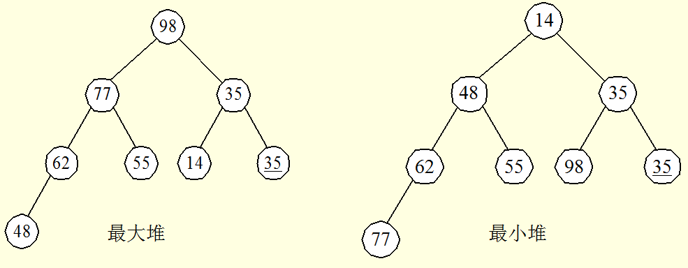

# 堆/最大堆/最小堆/优先队列

## 特性

1. 堆是一棵完全二叉树。即除了最底层，其他层的节点都被元素填满，且最底层尽可能地从左到右填入。
2. 任意节点小于（或大于）它的所有后裔，最小元（或最大元）在堆的根上（**堆序性**）。

3. 在数组中
   - 根节点的位置总是在数组索引为 0 的位置
   - 节点的父节点索引位置为 `Math.floor((i - 1) / 2)`
   - 节点的左孩子索引为 `2 * i + 1`，右孩子索引为为 `2 * i + 2`

## 用途
- **优先队列**：将堆中节点的比较函数改为节点的优先级比较

## 实现
- **插入**：插入时，追加到数组尾部，然后与父节点`Math.floor((i - 1) / 2)`比较，根据比较函数来决定是否交换位置，重复该步骤。
- **查询**：查询与数组的查询一致，依次遍历查询即可。
- **删除**：
  1. 从堆末尾去除最后一个元素，替换要删除的元素。
  2. 判断要删除的元素有没有父元素，如果有父元素且当前元素比父元素大（小），会向上进行比较。
  3. 否则向下进行比较，比较是取左右节点中较大（小）者，然后判断是否需要交换位置
- **取数**：每次都取头部元素，即最大（或最小）元素。取完后执行步骤类似于删除步骤，不过只需要向下进行比较即可。

## 参考

- [堆的实现](https://blog.csdn.net/tuke_tuke/article/details/50357939)