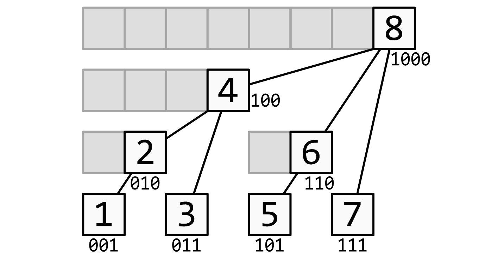

# 树状数组

## 介绍

树状数组的代码要比线段树短，思维更清晰，速度也更快，**在解决一些单点修改的问题时，树状数组是不二之选**。

## 原码

原码就是符号位加上真值的绝对值, 即用第一位表示符号, 其余位表示值. 比如如果是8位二进制：

```javascript
[+1]原 = 0000 0001

[-1]原 = 1000 0001
```

## 反码

- 正数的反码是其本身
- 负数的反码是在其原码的基础上, 符号位不变，其余各个位取反

```javascript
[+1] = [00000001]原 = [00000001]反

[-1] = [10000001]原 = [11111110]反
```

## 补码

- 正数的补码就是其本身
- 负数的补码是其反码 + 1

```javascript
[+1] = [00000001]原 = [00000001]反 = [00000001]补

[-1] = [10000001]原 = [11111110]反 = [11111111]补
```

## 工作原理

下面这张图展示了树状数组的工作原理：



这个结构和线段树有些类似：用一个大节点表示一些小节点的信息，进行查询的时候只需要查询一些大节点而不是所有的小节点。

## x & -x

`x & -x` 用于判断树状数组管理哪些数：

```javascript
8 & -8
0b1000 & -0b1000 => 0b1000 & 0b1000 = 8 
7 & -7
0b111 & -0b111 => 0b111 & 0b001 = 1
```

## 实现

```javascript
class FenwickTree {
  constructor(arraySize) {
    this.arraySize = arraySize
    // 数组长度 + 1
    this.treeArray = Array(this.arraySize + 1).fill(0)
  }

  increase(position, value) {
    if (position < 1 || position > this.arraySize) {
      throw new Error('position 超出范围了')
    }

    // 每次改变一个元素时，后续管着该元素的值也要随之变化。
    // 这里体现了单点修改值的优势，只需要更改后续对应的元素即可，不需要所有的值都更改。
    for (let i = position;i <= this.arraySize;i += (i & -i)) {
      this.treeArray[i] += value
    }

    return this
  }

  query(position) {
    if (position < 1 || position > this.arraySize) {
      throw new Error('position 超出范围了')
    }

    let sum = 0
    // 找到当前元素管着的元素，然后找到之前元素管着的元素，依次向前寻找。
    for (let i = position;i > 0;i -= (i & -i)) {
      sum += this.treeArray[i]
    }

    return sum
  }

  queryRange(leftIndex, rightIndex) {
    if (leftIndex > rightIndex) {
      throw new Error('左index不能超过右index');
    }

    if (leftIndex === 1) {
      return this.query(rightIndex);
    }

    return this.query(rightIndex) - this.query(leftIndex - 1);
  }
}
```

## 参考

- [原码/反码/补码](https://www.cnblogs.com/zhangziqiu/archive/2011/03/30/computercode.html)
- [fenwick](https://oi-wiki.org/ds/fenwick/)