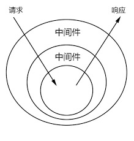

# 手写简版express

## 简单使用

```javascript
const express = require('express')
const app = new express()
app.use((req, res, next) => {
  console.log('middleware start')
  next()
  console.log('middleware end')
})
app.get('/', (req, res, next) => {
  console.log('home page')
  res.send('I am home page.')
})
app.listen(3000)

// 打印
// middleware start
// home page
// middleware end
```

可以看出，`express`可以被实例化，且包含`use/get/listen`等方法。而且`use/get`方法内部存在一定的执行顺序，这个执行顺序符合“洋葱模型”：从外到内再从内到外。



## listen方法

首先实现`listen`方法，`express`的服务是建立在`http`模块之上的。因此，可以对`http`进行一层封装：

```javascript
const http = require('http')

class Express {
  listen(...args) {
    const server = http.createServer((req, res) => {
      // handle 是发送请求时触发的事件，后续会进行实现
      this.handle(req, res)
    })
    server.listen(...args)
    this.server = server
  }
}
```

## 中间件机制

```javascript
const m1 = (req, res, next) => {
  console.log('middleware1 start');
  next()
  console.log('middleware1 end');
}

const m2 = (req, res, next) => {
  console.log('middleware2 start');
  next()
  console.log('middleware2 end');
}

const m3 = (req, res, next) => {
  console.log('middleware3 start');
  next()
  console.log('middleware3 end');
}
```

以上代码如何才能按照以下顺序执行呢？

```javascript
// middleware1 start
// middleware2 start
// middleware3 start
// middleware3 end
// middleware2 end
// middleware1 end
```

`express`里是使用一个`next`方法进行实现的：

```javascript
const stack = []
stack.push(m1)
stack.push(m2)
stack.push(m3)

function handle(req, res, out) {
  let idx = 0
  next()
  function next() {
    if (idx < stack.length) {
      const fn = stack[idx]
      idx += 1
      fn(req, res, next)
    } else {
      out()
    }
  }
}

handle({}, {}, () => {
  console.log('end')
})

// middleware1 start
// middleware2 start
// middleware3 start
// end
// middleware3 end
// middleware2 end
// middleware1 end
```

整个中间件机制的核心代码只有几行！

## Layer类

根据上面的`next`的代码可以得知，在实现中间件之前，需要维护一个数组，这个数组里的元素包含`(req, res, next) => {}`。另外由于中间件和请求在执行时，需要匹配路径和方法，所以我们可以定义一个`Layer`类，用于管理路径匹配和方法执行：

```javascript
class Layer {
  constructor(path, method, handle) {
    this.path = path
    this.method = method
    this.handle = handle
  }
  // 1. 进行路径匹配
  match(path = '/', method) {
    // 这里简单匹配一下
    // 如果是中间件，path不存在时，符合要求
    // 如果是中间件，path存在且匹配时，符合要求
    const isMiddleware = !this.path
      || !this.method && path.indexOf(this.path) !== -1
    // 如果是请求，path 和 method 均匹配时符合要求
    const isRequestMatch = path.indexOf(this.path) !== -1
      && method.toLowerCase() === this.method
    return isMiddleware || isRequestMatch
  }
  // 2. 进行执行方法
  handleMethod(req, res, next) {
    try {
      this.handle(req, res, next)
    } catch (err) {
      next(err)
    }
  }
}
```

`stack`里存放的就是这些`layer`。在用于发送请求时，只需要遍历`stack`执行`layer.handleMethod`方法即可实现中间件的效果。下一步，我们则是定义中间件和请求方法。

## get/post等方法

遍历`methods`，进行方法注册。这样在使用`app.get/post/...`的时候就会收集相应的回调函数：

```javascript
class Express {
  // 执行函数数组，存放的是 layer
  stack = []

  constructor() {
    this.init()
  }

  init() {
    // 请求方法：get、post等等
    const methods = ['get', 'post', 'put', 'delete']
    methods.forEach((method) => {
      this[method] = (path, callback) => {
        const layer = new Layer(path, method, callback)
        this.stack.push(layer)
      }
    })
  }
}
```

## use方法

`use`方法与`methods`类似，也是收集回调函数的过程。这里将传递的参数简单分为了3种形式：

```javascript
use(middlewares) {
  let path = '/'
  let fns = []
  if (typeof middlewares === 'function') {
    // 1. 形式1：app.use(middleware)
    fns = [middlewares]
  } else if (Array.isArray(middlewares)) {
    // 2. 形式2：app.use([middleware])
    fns = middlewares
  } else {
    // 3. app.use(path, [middleware])
    path = 形式3：middlewares
    fns = Array.isArray(arguments[1]) ? arguments[1] : [arguments[1]]
  }
  if (!fns || fns.length === 0) {
    throw new TypeError('app.use() requires a middleware function')
  }

  fns.forEach((middleware) => {
    const layer = new Layer(path, undefined, middleware)
    this.stack.push(layer)
  })
}
```

## handle 方法

前面通过`methods`和中间件已经将回调都收集到`stack`当中了，接下来就是用户请求的时候，去`stack`中匹配相应路径，然后按中间件的形式执行回调函数。

```javascript
// 请求时，匹配url，然后找到对应的方法
handle(req, res, out) {
  let idx = 0
  const stack = this.stack
  next()
  function next(err) {
    // 从 stack 里匹配对应的执行函数
    let match = false
    let layer = null
    while (idx < stack.length) {
      layer = stack[idx]
      idx += 1
      // 这里简单匹配路径
      match = layer.match(req.url || '/', req.method)
      if (match) break
    }
    if (!match) {
      return out && out()
    }
    layer.handleMethod(req, res, next)
  }
}
```

## 完整代码

```javascript
const http = require('http')

class Layer {
  constructor(path, method, handle) {
    this.path = path
    this.method = method
    this.handle = handle
  }
  match(path = '/', method) {
    // 这里简单匹配一下
    // 如果是中间件，path不存在时，符合要求
    // 如果是中间件，path存在且匹配时，符合要求
    const isMiddleware = !this.path
      || !this.method && path.indexOf(this.path) !== -1
    // 如果是请求，path 和 method 均匹配时符合要求
    const isRequestMatch = path.indexOf(this.path) !== -1
      && method.toLowerCase() === this.method
    return isMiddleware || isRequestMatch
  }
  handleMethod(req, res, next) {
    try {
      this.handle(req, res, next)
    } catch (err) {
      next(err)
    }
  }
}

class Express {
  // 服务
  server = null
  // 执行函数队列
  stack = []

  constructor() {
    this.init()
  }

  init() {
    // 请求方法：get、post等等
    const methods = ['get', 'post', 'put', 'delete']
    methods.forEach((method) => {
      this[method] = (path, callback) => {
        const layer = new Layer(path, method, callback)
        this.stack.push(layer)
      }
    })
  }

  use(middlewares) {
    let path = '/'
    let fns = []
    if (typeof middlewares === 'function') {
      // 1. app.use(middleware)
      fns = [middlewares]
    } else if (Array.isArray(middlewares)) {
      // 2. app.use([middleware])
      fns = middlewares
    } else {
      // 3. app.use(path, [middleware])
      path = middlewares
      fns = Array.isArray(arguments[1]) ? arguments[1] : [arguments[1]]
    }
    if (!fns || fns.length === 0) {
      throw new TypeError('app.use() requires a middleware function')
    }

    fns.forEach((middleware) => {
      const layer = new Layer(path, undefined, middleware)
      this.stack.push(layer)
    })
  }

  // 请求时，匹配url，然后找到对应的方法
  handle(req, res, out) {
    let idx = 0
    const stack = this.stack
    next()
    function next(err) {
      // 从 stack 里匹配对应的执行函数
      let match = false
      let layer = null
      while (idx < stack.length) {
        layer = stack[idx]
        idx += 1
        // 这里简单匹配路径
        match = layer.match(req.url || '/', req.method)
        if (match) break
      }
      if (!match) {
        return out && out()
      }
      layer.handleMethod(req, res, next)
    }
  }

  listen(...args) {
    const server = http.createServer((req, res) => {
      this.handle(req, res)
    })
    server.listen(...args)
    this.server = server
  }
}

module.exports = Express
```

## 执行结果

```javascript
const Express = require('./lib/express')
const app = new Express()

const m1 = (req, res, next) => {
  console.log('middleware1 start');
  next()
  console.log('middleware1 end');
}

const m2 = (req, res, next) => {
  console.log('middleware2 start');
  next()
  console.log('middleware2 end');
}

const m3 = (req, res, next) => {
  console.log('middleware3 start');
  next()
  console.log('middleware3 end');
}

app.use(m1)
app.use('/a', m2)
app.use('/b', m3)

app.get('/a', (req, res, next) => {
  console.log('page a');
  res.end('page a')
})

app.get('/b', (req, res, next) => {
  console.log('page b');
  res.end('page b')
})

app.listen(3000, () => {
  console.log('server is running...')
})

// 访问 /a 时：
// middleware1 start
// middleware2 start
// page a
// middleware2 end
// middleware1 end
// middleware1 start // 这是由于访问 favicon.ico 导致的，可忽略。
// middleware1 end   // 这是由于访问 favicon.ico 导致的，可忽略。
```

## 总结

这里实现的代码比较简单，没有涉及到`router`的处理，主要是概括了`express`中间件的实现原理。**核心原理大致是：将use和get/post/...等方法注册的回调函数封装成layer形式，并推到stack当中。等用户发送请求时，去stack中依次按照路径和方法名匹配对应的layer。然后按照“洋葱模型”执行匹配到的layer。**