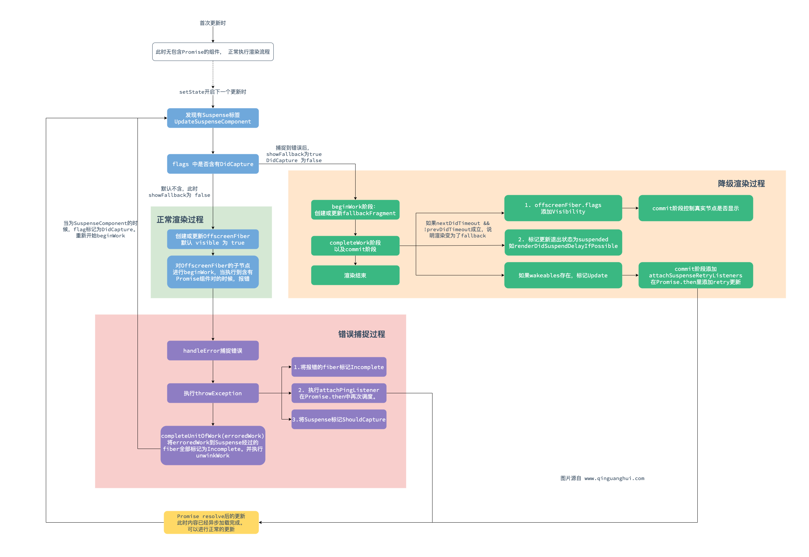

# Suspense 实现

1. 在`beginWork`时，遇到`Suspense`，默认是正常显示组件：创建一个`OffScreenComponent`来表示，此时`visible`为`true`。
2. 当加载到组件内部的`promise`时，由于第一次渲染，此时还未加载完成，会报错，抛出`promise`。
3. `handleError`捕捉到错误，首先开始`throwException`：
   1. 标记报错的`fiber.flags`为`Incomplete`。
   2. 向上查找，找到第一个`Suspense`。
   3. 在`Suspense.updateQueue`中添加报错信息（也就是抛出的`promise`）。
   4. 通过`attachPingListener`方法执行该`promise`，并在`then`回调里添加一个更新任务。
   5. 标记`Suspense fiber flags`为`ShouldCapture`。
4. 从报错的`fiber`开始，执行`completeWork`：
   1. 向上找到`ShouldCapture`的`Suspense`，标记为`DidCapture`。
   2. 查找过程中遇到的`fiber`，标记为`Incomplete`。
   3. 返回最终的`fiber`：`Suspense`或者`HostRoot`（没找到`Suspense`）。
5. 对找到的`Suspense`重新开始`beginWork`。此时`DidCapture`为`true`，显示`fallback`。`Suspense`的`child`指向`OffScreenComponent`（内部包含主要的组件），`OffScreenComponent`的`sibling`指向`fallbackChildFragment`（占位组件）。而真正进行渲染的是`fallbackChildFragment`。
6. 在`completeWork`的时候，对于`Suspense fiber`，检测到已经从显示`primary`（主组件）变为显示`fallback`（占位组件）。如果此时`updateQueue`存在，说明还有待更新的任务，标记`fiber`为`Update`。
7. 在`commitWork`阶段，对于标记`Update`的`Suspense`，会调用`attachSuspenseRetryListeners`将所有异步任务的`then`添加更新任务，对应的`lane`为`retryLane`。(如果之前已经更新过了，那么不需要重复更新，这里只是作为保障)
8. 等到`promise`加载完成，重新开始更新，此时就能正常的显示`primary`组件了。