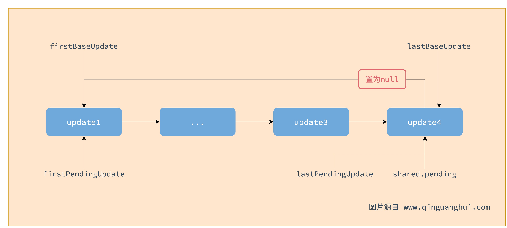

# UpdateQueue

## 简介

`React`节点状态存储在`fiber`的`memoizedState`属性当中，而老`fiber`节点到新`fiber`节点的更新操作则存储在`fiber`的`updateQueue`属性中。不同类型节点的`updateQueue`存储内容格式不相同，所对应的功能也有所差异。具体如下：

- `class`组件主要处理`state`的更新。
- 函数组件主要处理`effect`的`create、destroy`回调函数。
- 普通标签主要处理属性的变动。

## ClassComponent/HostRoot

`ClassComponent`和`HostRoot`两者更新的相关代码都存放在`react-reconciler`包的`ReactUpdateQueue.new.js`文件当中。下面分别介绍比较重要的几个函数。

### initializeUpdateQueue

```javascript
export function initializeUpdateQueue<State>(fiber: Fiber): void {
  const queue: UpdateQueue<State> = {
    // 初始化状态
    baseState: fiber.memoizedState,
    // 记录第一个更新，与优先级相关
    firstBaseUpdate: null,
    // 记录最后一个更新，与优先级相关
    lastBaseUpdate: null,
   // 存放更新的具体内容
    shared: {
      // 一个或多个更新形成的循环链表
      pending: null,
      // 如果当前处于 render 阶段，此时产生的更新会放在 interleaved 中
      // 在render结束时，interleaved 变为 pending queue
      interleaved: null,
      // 更新赛道
      lanes: NoLanes,
    },
    // 记录更新内容回调
    effects: null,
  };
  // 更新队列
  fiber.updateQueue = queue;
}
```

该函数主要用于初始化一个更新队列`updateQueue`。

### createUpdate

```javascript
export function createUpdate(eventTime: number, lane: Lane): Update<*> {
  const update: Update<*> = {
    // 更新创建开始时间
    eventTime,
    // 该更新的 lane
    lane,

    // 更新的标识符
    tag: UpdateState,
    // 更新的内容
    payload: null,
    // 更新的回调
    callback: null,

    // 指向下一个更新
    next: null,
  };
  return update;
}
```

`createUpdate`主要作用是创建一个更新。

### enqueueUpdate

`enqueueUpdate`主要作用是将新增的更新（`Update`）添加到循环链表中，并存放到`updateQueue.shared.pending`上，其核心代码如下：

```javascript
const pending = sharedQueue.pending;
if (pending === null) {
  update.next = update;
} else {
  update.next = pending.next;
  pending.next = update;
}
sharedQueue.pending = update;
```

**每次添加完update后，pending都会指向这个最新添加的update。由于是循环链表，所以当前的pending的next指向的是第一个更新。**

### processUpdateQueue

`processUpdateQueue`主要作用是执行`updateQueue`来更新`state`。第一段代码如下：

```javascript
if (pendingQueue !== null) {
  queue.shared.pending = null;
  // 找到最先的 update，然后将最后的一个 update 的 next 断开
  const lastPendingUpdate = pendingQueue;
  const firstPendingUpdate = lastPendingUpdate.next;
  lastPendingUpdate.next = null;
  if (lastBaseUpdate === null) {
    firstBaseUpdate = firstPendingUpdate;
  } else {
    lastBaseUpdate.next = firstPendingUpdate;
  }
  lastBaseUpdate = lastPendingUpdate;
}
```

这段代码可以用下图来表示：



注意：其中`置为null`表示那一条指向是被切断了，也就是不存在该指向了。**另外shared.pending是指向最后一次添加的update的**。

紧接着就是一个`while`循环遍历所有的`update`来处理`state`。在循环中有一个判断：

```javascript
if (!isSubsetOfLanes(renderLanes, updateLane)) {}
```

该判断主要是判断当前更新对应的`lane`是否在`renderLanes`中，如果不在，那么这次就不应该执行该更新。举一个例子，现在有`A,C,B,D`四个更新形成的链表，而当前的`renderLanes`只有`A,B`两个符合时，此时执行到更新`C`的时候，会先克隆一个`update`:

```javascript
const clone: Update<State> = {
  eventTime: updateEventTime,
  lane: updateLane,

  tag: update.tag,
  payload: update.payload,
  callback: update.callback,

  next: null,
};
```

然后将这个`update`形成链表，并且用`newFirstBaseUpdate`和`newLaseBaseUpdate`表示链表的头尾。

```javascript
// lane不符合，那么记录下当前的 update
if (newLastBaseUpdate === null) {
  newFirstBaseUpdate = newLastBaseUpdate = clone;
  newBaseState = newState;
} else {
  newLastBaseUpdate = newLastBaseUpdate.next = clone;
}
```

需要注意的是，一旦`C`记录下来了，遍历`B`的时候`newLastBaseUpdate !== null`，同样会被记录。换句话说，也就是当某一个更新的`lane`不符合时，后续所有的更新都会被单独记录下来。

另外一种情况是`lane`符合时，此时会进行执行`update`，并获取最新的`state`。

```javascript
newState = getStateFromUpdate(...)
```

`getStateFromUpdate`方法会根据`update`的`tag`和`payload`获取新的`state`。

随后，将执行了的`update`存放到`effects`中，以便更新完成时触发其回调。

```javascript
if (effects === null) {
  queue.effects = [update];
} else {
 effects.push(update);
}
```

最后，更新状态后，将对应的属性更新：

```javascript
queue.baseState = ((newBaseState: any): State);
queue.firstBaseUpdate = newFirstBaseUpdate;
queue.lastBaseUpdate = newLastBaseUpdate;
workInProgress.memoizedState = newState;
```

注意此时的`newState`代表的是执行了所有可执行`update`的`state`，如执行了`A，B`这两个更新。而`baseState`表示第一次`lane`不符合时，前面的`state`，如遇到`C`时，`lane`不符合，`baseState`记录的是`A`更新后的`state`。

这样的话，在下一轮更新时，由于`lastBaseUpdate`存在：

```javascript
if (lastBaseUpdate === null) {
  firstBaseUpdate = firstPendingUpdate;
} else {
  lastBaseUpdate.next = firstPendingUpdate;
}
```

此时会将下一轮的更新于当前轮次跳过的更新合并在一次执行，也就是下一轮在执行更新前，会执行本轮跳过的更新，如`B，C，D`这个三个更新。这也是为什么`baseState`只记录`A`更新的原因了，因为它可以作为下一轮更新的起始`state`。

### commitUpdateQueue

`commitUpdateQueue`比较简单，就是执行已经被执行了的`update`的`callback`。

```javascript
for (let i = 0;i < effects.length;i++) {
  const effect = effects[i];
  const callback = effect.callback;
  if (callback !== null) {
    effect.callback = null;
    callCallback(callback, instance);
  }
}
```

## FunctionComponent

函数式组件的`updateQueue`与`class`组件的差异比较大。它的`updateQueue`主要用于存放生命周期的回调函数。找到`ReactFiberHooks.new.js`文件的`pushEffect`方法，首先会创建一个`effect`：

```javascript
const effect: Effect = {
  // 表示 hook 的 tag
  tag,
  // 创建时的回调函数
  create,
  // 销毁时的回调函数
  destroy,
  // hook 的依赖
  deps,
  // 指向下一个 effect
  next: (null: any),
};
```

随后将该`effect`形成循环链表（该链表形式与`class`组件类似），放入到`updateQueue`的`lastEffect`属性当中：

```javascript
const firstEffect = lastEffect.next;
lastEffect.next = effect;
effect.next = firstEffect;
currentlyRenderingFiber.updateQueue.lastEffect = effect;
```

## HostComponent

`HostComponent`的`updateQueue`主要记录`props`的变化。

```javascript
const updatePayload = prepareUpdate(
  instance,
  type,
  oldProps,
  newProps,
  rootContainerInstance,
  currentHostContext,
);
workInProgress.updateQueue = (updatePayload: any);
```

`prepareUpdate`方法在`react-dom`包中的`ReactDOMHostConfig.js`文件中定义：

```javascript
return diffProperties(
    domElement,
    type,
    oldProps,
    newProps,
    rootContainerInstance,
  );
```

它主要是调用`diffProperties`方法，将新旧`props`进行对比，最后将改变了的属性记录成数组形式。其中偶数`index`为键，奇数`index`为值，结构大致如下：

```javascript
['name', '张三', 'id', 333, 'style', { color: 'red' }]
```
