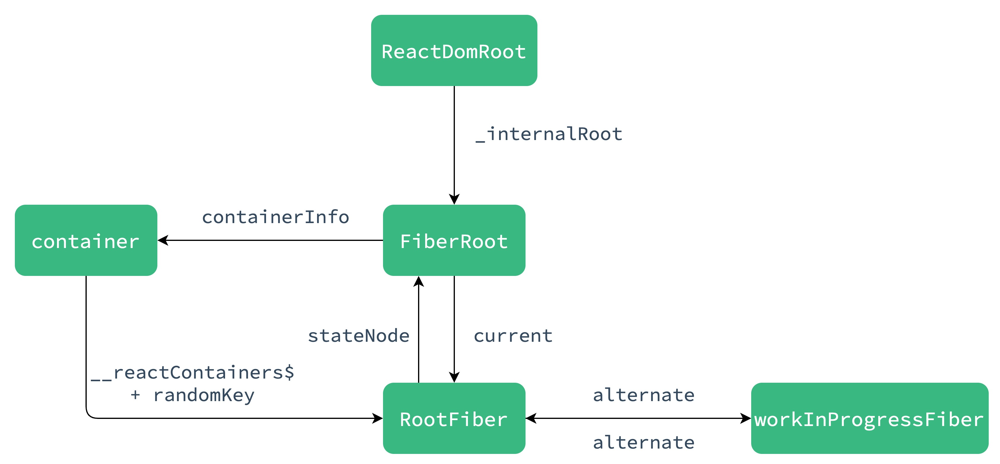

# React源码起始篇

## createRoot

`React`中如果想使用`ConcurrentMode`，需要使用`createRoot`函数来创建应用：

```javascript
const root = document.getElementById('root')
ReactDOM.createRoot(root).render(<App />)
```

在 `react-dom/src/client/ReactDomRoot.js`文件中找到`createRoot`定义：

```javascript
export function createRoot(
  container: Container,
  options?: CreateRootOptions,
): RootType {
  // ...

  // 1. 创建完成了根节点，返回的是 FiberRoot，为 ConcurrentRoot 模式
  const root = createContainer(
    container,
    ConcurrentRoot,
    hydrate,
    hydrationCallbacks,
    isStrictMode,
    concurrentUpdatesByDefaultOverride,
  );

  // 2. node 节点 和 rootFiber 的关系
  //  container['__reactContainer$' + randomKey] = root.current
  markContainerAsRoot(root.current, container);

  const rootContainerElement =
    container.nodeType === COMMENT_NODE ? container.parentNode : container;
  // 3. 在 container 上添加原生事件
  listenToAllSupportedEvents(rootContainerElement);

  // 实例化 root，root上挂载了 render, unmount 方法
  // this._internalRoot = internalRoot
  return new ReactDOMRoot(root);
}
```

`createRoot`方法主要做了两件事情：

1. 根据`rootContainer`创建`FiberRoot`。
2. 在`container`上添加原生事件。

`React`实现了一套自己的事件系统，几乎所有原生事件都绑定在`container`上，通过事件冒泡的方式捕捉具体的事件，详细的内容将在`React`事件系统章节讲解。这里主要讨论`createContainer`，找到`react-reconciler/src/ReactFiberRoot.new.js`文件中的`createFiberRoot`函数：

```javascript
export function createFiberRoot(
  containerInfo: any,
  tag: RootTag,
  hydrate: boolean,
  hydrationCallbacks: null | SuspenseHydrationCallbacks,
  isStrictMode: boolean,
  concurrentUpdatesByDefaultOverride: null | boolean,
): FiberRoot {
  // 1. 创建Fiber root
  const root: FiberRoot = (new FiberRootNode(containerInfo, tag, hydrate): any);
  
  // 2. 创建一个 tag 为 HostRoot 的 RootFiber
  // 并且带上当前的模式（tag就是对应的模式，当然还会进行更一层的判断）
  const uninitializedFiber = createHostRootFiber(
    tag,
    isStrictMode,
    concurrentUpdatesByDefaultOverride,
  );

  // 3. 建立 fiberRoot 和 rootFiber的关系
  root.current = uninitializedFiber;
  uninitializedFiber.stateNode = root;

  const initialState = {
    element: null,
  };
  uninitializedFiber.memoizedState = initialState;

  // 4. 初始化 update queue
  initializeUpdateQueue(uninitializedFiber);

  return root;
}
```

`createContainer`调用的是`createFiberRoot`函数，主要作用为：

1. 根据`container`创建`FiberRoot`。
2. 创建一个`tag`为`HostRoot`的`RootFiber`。
3. 建立`FiberRoot`和`RootFiber`的联系。

整个过程创建完成后，会形成如下的结构：



其中多出来的`workInProgressFiber`是后续`render`时才会创建。

执行完`createRoot`函数后，我们已经能够获取到`ReactDomRoot`的实例了，接下来就是执行`render`函数了。

```javascript
ReactDOM.createRoot(root).render(<App />)
```

## jsx

在`React`中，`JSX`语法在编译时会被`Babel`编译为`React.createElement`方法。这就是为什么在每个使用了`jsx`语法的文件中，必须显示的引入`React`的原因，否则在运行的时候会无法找到`React.createElement`方法。

`JSX`并不是只能被编译为`React.createElement`方法，你可以通过[@babel/plugin-transform-react-jsx(opens new window)](https://babeljs.io/docs/en/babel-plugin-transform-react-jsx)插件显式告诉`Babel`编译时需要将`JSX`编译为其他函数的调用（默认为`React.createElement`）。

#### 标签名为小写时

`JSX`编译时只要分为两种情况，一种是标签名为小写时，如：

```javascript
<div className="normal-tag">content</div>
```

会被编译成：

```javascript
React.createElement(
  "div",
  {
    className: "normal-tag"
  },
  "content"
);
```

**注意，此时第一个参数为字符串形式。**

#### 标签名为大写时

例如编译函数式组件时：

```javascript
<App className="function-component">content</App>
```

会被编译为：

```javascript
React.createElement(
  App,
  {
    className: "function-component"
  },
  "content"
);
```

**注意此时第一个参数为变量，这一点尤为重要，因为函数式组件，类组件，lazy组件等组件的渲染过程都与这个变量相关。**

`jsx`的编译结果可以通过[这里](https://babeljs.io/repl#?browsers=defaults%2C%20not%20ie%2011%2C%20not%20ie_mob%2011&build=&builtIns=false&corejs=3.6&spec=false&loose=false&code_lz=DwQQDmAEDGA2CGBnRA5eBbApgXgEQDsB7AJ3XlgFoAXeAc1wD5pD8rNXgB6cMBoA&debug=false&forceAllTransforms=false&shippedProposals=false&circleciRepo=&evaluate=true&fileSize=false&timeTravel=false&sourceType=module&lineWrap=true&presets=env%2Creact&prettier=true&targets=&version=7.15.6&externalPlugins=&assumptions=%7B%7D)进行预览调试。

## createElement

`JSX`编译后就会调用`createElement`方法了，该方法是在`React/src/ReactElement.js`文件中定义：

```javascript
export function createElement(type, config, children) {
  let propName;

  const props = {};

  let key = null;
  let ref = null;
  let self = null;
  let source = null;

  // 1. 处理 props
  if (config != null) {
    // 为了简化代码，部分代码已删除
    ref = config.ref;
    key = '' + config.key;
    for (propName in config) {
      props[propName] = config[propName];
    }
  }

  // 2. 处理 children，如果 children 长度大于1，形成数组形式
  const childrenLength = arguments.length - 2;
  if (childrenLength === 1) {
    props.children = children;
  } else if (childrenLength > 1) {
    const childArray = Array(childrenLength);
    for (let i = 0;i < childrenLength;i++) {
      childArray[i] = arguments[i + 2];
    }
    props.children = childArray;
  }

  // 3. 处理 default props
  if (type && type.defaultProps) {
    const defaultProps = type.defaultProps;
    for (propName in defaultProps) {
      if (props[propName] === undefined) {
        props[propName] = defaultProps[propName];
      }
    }
  }
  return ReactElement(
    type,
    key,
    ref,
    self,
    source,
    ReactCurrentOwner.current,
    props,
  );
}
```

`type`表示的是`jsx`编译后的第一个参数，可能为普通字符串，也可能是一个变量。第二个参数`config`则是编译后节点上的属性。第三个及之后的参数表示该节点的`children`节点，如果子节点数目大于1，转换为数组形式。最终，经过`props,children`的处理后，会返回一个`ReactElement`对象。

## render

接下来是正式的`render`阶段。找到`ReactDOMRoot.js`文件：

```javascript
ReactDOMRoot.prototype.render = function (children: ReactNodeList): void {
  const root = this._internalRoot;
  updateContainer(children, root, null, null);
};
```

`render`函数很简单，第一个是找到`FiberRoot`，然后调用`updateContainer`方法处理传入的`children`（也就是`<App/>`编译后对应的`ReactElement`节点）。

## updateContainer

在`react-reconciler/src/ReactFiberReconciler.new.js`文件中：

```javascript
export function updateContainer(
  element: ReactNodeList,
  container: OpaqueRoot,
  parentComponent: ?React$Component<any, any>,
  callback: ?Function,
): Lane {
  // 1. 拿到 RootFiber
  const current = container.current;
  
  // 2. 获取 current time
  const eventTime = requestEventTime();
  
  // 3. 获取对应的 lane
  // 第一次进来，concurrentMode，返回的 lane 为 DefaultLane
  const lane = requestUpdateLane(current);

  // 4. 根据 时间 + 优先级 创建一个更新对象
  const update = createUpdate(eventTime, lane);
  update.payload = { element };
  // 如果传了 callback，将 callback 放入到 update 中
  callback = callback === undefined ? null : callback;
  if (callback !== null) {
    update.callback = callback;
  }

  // 5. update 建立成循环链表
  // 并存放到 fiber.updateQueue.shared.pending 当中
  enqueueUpdate(current, update, lane);
  
  // 6. 开始调度
  const root = scheduleUpdateOnFiber(current, lane, eventTime);
  if (root !== null) {
    entangleTransitions(root, current, lane);
  }

  return lane;
}
```

第二步中，`requestEventTime`获取当前的时间，通常使用`preformance.now()`获取，用于表示该任务执行的起始时间。该时间会在优先级调度中用到，用于判断任务是否过期。

第三步中，`requestUpdateLane`获取本次更新的`lane`，不同的`lane`对应于不同的优先级。具体`lane`的描述在`lane`模型章节中提到。

第四步和第五步主要是创建一个`update`，然后将该`update`放到`updateQueue`中，用于表示本次更新的内容。

第六步就要开始正式的调度过程，也就是正式的任务调度和渲染环节。`class`组件中的`setState/forceUpdate`方法最后都会执行该函数进行调度，因此十分重要。

## scheduleUpdateOnFiber

找到`react-reconciler/src/ReactFiberWorkLoop.new.js`文件：

```javascript
export function scheduleUpdateOnFiber(
  fiber: Fiber,
  lane: Lane,
  eventTime: number,
): FiberRoot | null {
  checkForNestedUpdates();
  warnAboutRenderPhaseUpdatesInDEV(fiber);

  // 从 fiber 一直向上合并 lanes，更改了 lanes , childLanes
  // 当向上寻找fiber 最终找到 rootFiber 时，会返回对应的 fiberRoot
  const root = markUpdateLaneFromFiberToRoot(fiber, lane);

  // 更新 fiber root 上 pendingLanes，加入当前 lane
  // 计算 lane 所在位置（32条lane中的第几级），并将 eventTime 放到 eventTimes 里
  // eventTime 表示创建这个 update 的时间。也是 lane 对应的时间。
  markRootUpdated(root, lane, eventTime);

  // 开始调度任务
  ensureRootIsScheduled(root, eventTime);
  
  return root;
}
```

首先会向上递归更新每个`fiber`的`lanes`和`childLanes`，并返回`fiberRoot`。随后标记当前任务的时间，计算当前`lane`处于哪条”赛道“，并在对应赛道上记录下本次更新的起始时间：

```javascript
root.eventTimes[index] = eventTime
```

最后调用`ensureRootIsScheduled`方法开始真正的调度过程。

## ensureRootIsScheduled

还是在`ReactFiberWorkLoop.new.js`文件中：

```javascript
function ensureRootIsScheduled(root: FiberRoot, currentTime: number) {
  // 1. root.callbackNode 是在每次调度完赋值的，也就是本函数的末尾
  // 它代表当前的任务（scheduler中返回的任务）
  const existingCallbackNode = root.callbackNode;

  // 2. 递归 pendingLanes，如果 lane 过期了会加入到 expiredLanes 中
  // 如果老任务一直被打断，但是老任务时间到了，就会将其置为过期，这样下次就可以以最高优先级进行更新了。
  markStarvedLanesAsExpired(root, currentTime);

  // 3. 根据优先级来判断下一个应该执行的 lane（选取优先级最高的 lane）
  const nextLanes = getNextLanes(
    root,
    root === workInProgressRoot ? workInProgressRootRenderLanes : NoLanes,
  );

  // 4. 说明没有要执行的任务
  if (nextLanes === NoLanes) {
    if (existingCallbackNode !== null) {
      // 取消当前任务
      cancelCallback(existingCallbackNode);
    }
    root.callbackNode = null;
    root.callbackPriority = NoLane;
    return;
  }

  // 5. 获取 nextLanes 中的最高优先级
  const newCallbackPriority = getHighestPriorityLane(nextLanes);
	// 当前执行任务的优先级
  const existingCallbackPriority = root.callbackPriority;
  // 如果与当前优先级没有变化，那么直接返回。
  // 这就是为什么能实现批量更新的原理：
  // 首先 setState 会进行 schedule，再下一次 setState 的时候，由于优先级相同，不会进行 schedule
  if (existingCallbackPriority === newCallbackPriority) {
    return;
  }

  // 6. 优先级变化了，由于每次都是取的最高优先级，所以一定是优先级更高的任务进来了。
  // 那么取消上一个任务
  if (existingCallbackNode != null) {
    // cancelCallback 主要操作就是将 任务的 callback 置空了。
    cancelCallback(existingCallbackNode);
  }

  // 7. 调度
  let newCallbackNode;
  // 如果优先级为同步优先级
  if (newCallbackPriority === SyncLane) {
    // 17版本为 concurrentMode 模式。搜集需要同步执行的函数
    scheduleSyncCallback(performSyncWorkOnRoot.bind(null, root));
    if (supportsMicrotasks) {
       // 如果支持微任务，那么用微任务执行 flushSyncCallbacks
       scheduleMicrotask(flushSyncCallbacks);
    } else {
      scheduleCallback(ImmediateSchedulerPriority, flushSyncCallbacks);
    }
    newCallbackNode = null;
  } else {
    // 如果优先级不为同步
    let schedulerPriorityLevel;
    // 将 lanes 转化为 scheduler 库的优先级
    switch (lanesToEventPriority(nextLanes)) {
      case DiscreteEventPriority:
        schedulerPriorityLevel = ImmediateSchedulerPriority;
        break;
      case ContinuousEventPriority:
        schedulerPriorityLevel = UserBlockingSchedulerPriority;
        break;
      case DefaultEventPriority:
        schedulerPriorityLevel = NormalSchedulerPriority;
        break;
      case IdleEventPriority:
        schedulerPriorityLevel = IdleSchedulerPriority;
        break;
      default:
        schedulerPriorityLevel = NormalSchedulerPriority;
        break;
    }
    // 调度过程。计算过期时间，推入到任务队列，执行任务队列，
    // 执行 callback，并且封装成为一个任务，进行返回 =》 newCallbackNode
    newCallbackNode = scheduleCallback(
      schedulerPriorityLevel,
      performConcurrentWorkOnRoot.bind(null, root),
    );
  }

  // 8. 进行赋值
  root.callbackPriority = newCallbackPriority;
  root.callbackNode = newCallbackNode;
}
```

这里涉及到”饥饿问题“以及任务被打断的过程。举个例子来讲，现在正在执行一个优先级为`A`的`A`更新任务，然后又进来了一个优先级为`B`的`B`任务，由于任务`B`的优先级高于`A`，那么`nextLanes`取的是任务`B`的优先级，因此会打断任务`A`，执行`cancelCallback`，然后开始任务`B`的调度`scheduleCallback`。如果下一次任务`C`进来又比任务`A`优先级高，导致任务`A`又没有被执行，并且任务`A`已经达到了预定的过期时间，这个时候就会导致`饥饿问题`。解决办法就是执行`markStarvedLanesAsExpired`方法，将任务`A`标记为过期，这样下一次它的执行优先级就为最高了，也就能够得到执行。

想要理解这个例子，需要先理解任务调度，优先级以及过期时间等概念，这些在调度章节会进行详细讲解。