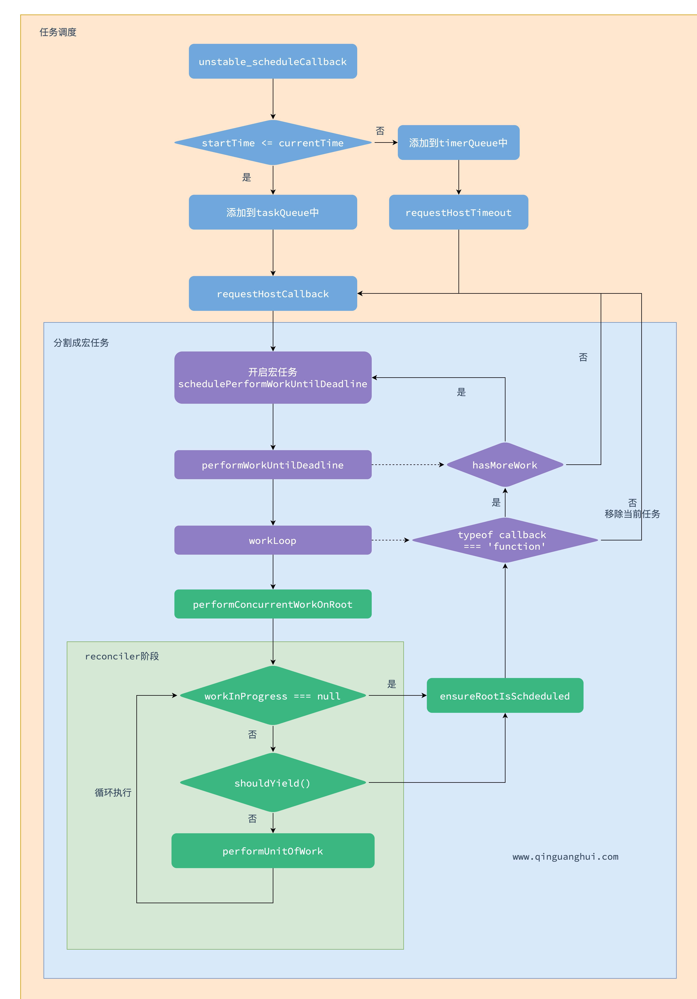

# 任务调度 Scheduler

## 调度总流程


## 时间切片

在浏览器一帧章节里介绍到，在浏览器一帧里大致会有以下几个阶段：

```javascript
一个task(宏任务) -> 队列中全部微任务 -> requestAnimationFrame -> 浏览器重排/重绘 -> requestIdleCallback
```


如果`React`的更新渲染层次比较深，渲染时间超过一帧（16.6ms）的时间，那么就会阻塞浏览器的重排/重绘。通常情况下，在100ms内用户感知不会很明显，但是超过这个值后就会感觉到卡顿。

在`ConcurrentMode`中，`React`通过**时间切片**的方法解决这一问题，通过将更新中的`render`阶段划分一个个的小任务，这个小任务指的是`beginWork` + `completeWork`两个阶段（`fiber`结构就是为了能方便的构建这些小任务），通常来说这些小任务连续执行的最长时间为`5ms`。

```javascript
function workLoopConcurrent() {
  // shouldYield 代表这个任务开启的时间 与 现在的时间 之间的间隔是否大于 定义的时间间隔。
  // 比如执行超过了 5ms 那么此时 shouldYield() 就为true，需要暂停渲染。
  while (workInProgress !== null && !shouldYield()) {
    performUnitOfWork(workInProgress);
  }
}
```

## 简单例子

那么`React`是如何进行实现时间切片即任务最长连续执行时间为`5ms`的呢？以一个简单点的例子来讲：

```javascript
<button id="btn" onclick="handle()">点击事件</button>

<script>
  function handle() {
    console.log('click 事件触发 ')
  }

  function performUnitOfWork() {
      performUnitOfWork()
  }

  performUnitOfWork()
</script>
```

在上面的代码中当点击按钮时，并不会触发事件。因为`performUnitOfWork`是同步循环执行，会导致完全没有时间执行其他任务，以及浏览器也不会进行重排重绘。这样`handle`的代码也就不会执行了。那么怎样才能使得`handle`中的代码有时间执行呢？在浏览器帧章节里提到，一次渲染中可以执行多次的宏任务，并且浏览器会自己来调节具体执行多少次，而且一般不会阻塞正常渲染。那么代码可以改写如下：

```javascript
<button id="btn" onclick="handle()">点击事件</button>

<script>
  function handle() {
    console.log('click 事件触发 ')
  }

  function performUnitOfWork() {
      setTimeout(performUnitOfWork)
  }

  performUnitOfWork()
</script>
```

改写成这样后，`click`事件就能触发了，触发的顺序如下图所示：


这样就能在渲染任务中间穿插执行其他任务了，但是如何保证渲染任务中连续执行的小任务只执行`5ms`，并且保证留有足够的时间给浏览器执行其他任务和渲染呢？这就要使用到`shouldYield()`方法了。**每次执行一个小任务时记录开始时间，下次执行的时候看与开始时间是否相隔超过5ms，如果没有超过继续执行下一个小任务，此时均为同步执行。如果超过5ms就跳出当前任务，并设置一个宏任务开始下一轮事件循环**。这样它们之间就留有充足的时间执行其他任务了。

## scheduleCallback

调度的过程通过`Scheduler`包实现。在`ensureRootIsScheduled`方法中，会开始调度：

```javascript
newCallbackNode = scheduleCallback(
  schedulerPriorityLevel,
  performConcurrentWorkOnRoot.bind(null, root),
)
```

`scheduleCallback`方法主要任务是按照一定的优先级执行一个函数，注意`performConcurrentWorkOnRoot.bind(null, root)`是一个函数，而不是函数执行的结果。

`scheduleCallback`方法是调用了`Scheduler`包的`unstable_scheduleCallback`方法，打开文件`shceduler/src/forks/Scheduler.js`文件，`unstable_scheduleCallback`首先会根据`options`的`delay`计算任务的真正的开始时间`startTime`。

```javascript
  var currentTime = getCurrentTime();

  // 起始时间
  var startTime;
  if (typeof options === 'object' && options !== null) {
    var delay = options.delay;
    if (typeof delay === 'number' && delay > 0) {
      startTime = currentTime + delay;
    } else {
      startTime = currentTime;
    }
  } else {
    startTime = currentTime;
  }
```

然后根据优先级设置不同的`timeout`，优先级越低的任务，就放到越后面执行：

```javascript
var timeout;
switch (priorityLevel) {
  case ImmediatePriority:
    timeout = IMMEDIATE_PRIORITY_TIMEOUT;
    break;
  case UserBlockingPriority:
    timeout = USER_BLOCKING_PRIORITY_TIMEOUT;
    break;
  case IdlePriority:
    timeout = IDLE_PRIORITY_TIMEOUT;
    break;
  case LowPriority:
    timeout = LOW_PRIORITY_TIMEOUT;
    break;
  case NormalPriority:
  default:
    timeout = NORMAL_PRIORITY_TIMEOUT;
    break;
}
var expirationTime = startTime + timeout;
```
`expirationTime`代表加入优先级后，任务应该开始执行的时间。随后根据开始时间和过期时间创建一个任务：
```javascript
  var newTask = {
    // 任务id
    id: taskIdCounter++,
    // 任务的执行内容
    callback,
    // 任务的优先级
    priorityLevel,
    // 任务的实际开始时间
    startTime,
    // 任务加入优先级后的开始时间，称为过期时间
    expirationTime,
    // 任务排序的index，这里为过期时间，优先级越低，排序越靠后
    sortIndex: -1,
  };
```

`React`中任务队列有两种，一种是`taskQueue`，当任务`startTime`小于等于`currentTime`时，任务都会放入到`taskQueue`中。另一种是`timerQueue`，当任务`startTime`大于`currentTime`时，任务都会放入到`timerQueue`中。每次执行任务时会通过`advanceTimers`方法检测`currentTime`，如果`currentTime`大于`startTime`，那么就会将该任务从`timerQueue`中添加到`taskQueue`中。这两个任务队列都是**最小堆**结构，过期时间越小，最先执行。

对于`taskQueue`，会调用`requestHostCallback`方法执行任务。如果`taskQueue`为空，就会在`timerQueue`中寻找最先的任务，并通过`requestHostTimeout`方法设置一个定时器执行任务。

最终都会调用`requestHostCallback`中的`schedulePerformWorkUntilDeadline`开始任务。

```javascript
let schedulePerformWorkUntilDeadline;
if (typeof localSetImmediate === 'function') {
  schedulePerformWorkUntilDeadline = () => {
    localSetImmediate(performWorkUntilDeadline);
  };
} else if (typeof MessageChannel !== 'undefined') {
  const channel = new MessageChannel();
  const port = channel.port2;
  channel.port1.onmessage = performWorkUntilDeadline;
  schedulePerformWorkUntilDeadline = () => {
    port.postMessage(null);
  };
} else {
  schedulePerformWorkUntilDeadline = () => {
    localSetTimeout(performWorkUntilDeadline, 0);
  };
}
```
这里相当于开启了一个宏任务，最后会执行`performWorkUntilDeadline`方法。
```javascript
const performWorkUntilDeadline = () => {
  const currentTime = getCurrentTime();
  startTime = currentTime;
  const hasTimeRemaining = true;

  let hasMoreWork = true;
  try {
    // scheduledHostCallback 这里指的是 flushWork.
    // 如果是时间到了，那么他就会暂停，然后返回说还有更多任务，
    // 此时调用 schedulePerformWorkUntilDeadline。
    // 相当于执行了一个异步任务，而在这个任务之间，可以接受一些用户操作之类的任务进来，而不是直接阻塞！
    hasMoreWork = scheduledHostCallback(hasTimeRemaining, currentTime);
  } finally {
    if (hasMoreWork) {
      // 如果有更多的任务，开始下一个宏任务。
      schedulePerformWorkUntilDeadline();
    } else {
      isMessageLoopRunning = false;
      scheduledHostCallback = null;
    }
  }
};
```

这里`scheduledHostCallback`方法对应的是`flushWork`方法:

```javascript
function flushWork(hasTimeRemaining, initialTime) {
	return workLoop(hasTimeRemaining, initialTime);
}
```

## workLoop

```javascript
function workLoop(hasTimeRemaining, initialTime) {
  // 当前任务的执行时间
  let currentTime = initialTime;
  // 调整 timers，将已到时间的 timer 放入到 taskQueue 中
  advanceTimers(currentTime);
  // 取出第一个任务
  currentTask = peek(taskQueue);
  while (
    currentTask !== null &&
    !(enableSchedulerDebugging && isSchedulerPaused)
  ) {
    // 任务未过期，且没有多余的时间可供执行，退出循环。
    // 过期时间只是用作判断最迟的执行时间，并且用于排序。
    // startTime 才是一个任务真正应该的起始时间。
    // 如果任务未过期，但是里面的startTime都已经开始了，此时有剩余执行时间，依然是可以执行的。
    if (
      currentTask.expirationTime > currentTime &&
      (!hasTimeRemaining || shouldYieldToHost())
    ) {
      // 如果任务没有过期，且没有多余时间执行任务，那么就会退出执行。
      break;
    }
    const callback = currentTask.callback;
    if (typeof callback === 'function') {
      currentTask.callback = null;
      currentPriorityLevel = currentTask.priorityLevel;
      // 是否属于过期的任务，可能存在还没过期的任务。
      const didUserCallbackTimeout = currentTask.expirationTime <= currentTime;
      // 执行任务
      const continuationCallback = callback(didUserCallbackTimeout);
      // 如果是 yield，那么说明时间到了，会返回有一个 perform 函数
      // 该函数主要用于继续执行后续 render
      // 更新执行完后的时间
      currentTime = getCurrentTime();
      if (typeof continuationCallback === 'function') {
        // 如果执行完后又返回了 function，赋值给当前任务的callback
        currentTask.callback = continuationCallback;
      } else {
        // 否则的话，将当前任务移除。中断在这个位置发生，高优先任务会把低优先任务的callback置空。
        if (currentTask === peek(taskQueue)) {
          pop(taskQueue);
        }
      }
      // 更新 timerQueue
      advanceTimers(currentTime);
    } else {
      // 移除 task
      pop(taskQueue);
    }
    // 取任务
    currentTask = peek(taskQueue);
  }

  if (currentTask !== null) {
    // 返回是否还有任务
    return true;
  } else {
    // 说明 currentTask 执行完了
    const firstTimer = peek(timerQueue);
    if (firstTimer !== null) {
      // 处理 timerQueue
      requestHostTimeout(handleTimeout, firstTimer.startTime - currentTime);
    }
    return false;
  }
}
```

这里的`callback`对应`performConcurrentWorkOnRoot.bind(null, root)`方法：

```javascript
const continuationCallback = callback(didUserCallbackTimeout);
if (typeof continuationCallback === 'function') {
	currentTask.callback = continuationCallback;
}
```

## performConcurrentWorkOnRoot

```javascript
function performConcurrentWorkOnRoot(root, didTimeout) {
  // didTimeout 表示任务的 过期时间 > 当前的执行时间，而且此时是有执行的空闲时间的。
  // 如果有用户输入的 lane 或者 过期 lane，并且上述条件满足，
  // 那么会执行 renderRootConcurrent，否则按同步执行。
  // shouldTimeSlice 会判断当前是 默认还是有用户输入，如果是的话就是同步渲染。
  // didTimeout 表示当前的任务是否过期，如果过期了，那么同步执行。否则并发执行。
  let exitStatus =
    shouldTimeSlice(root, lanes) &&
      (disableSchedulerTimeoutInWorkLoop || !didTimeout)
      ? renderRootConcurrent(root, lanes)
      : renderRootSync(root, lanes);

  // 完成后，继续 schedule，发现没有 lane 就退出了
  // 相当于判断这里有没有更高优先级的任务,
  // 如果没有, 那么下面的比较会执行，然后 performConcurrentWorkOnRoot
  // 否则 callbackNode.callback = null 
  ensureRootIsScheduled(root, now());
  
  // originalCallbackNode 是在这之前赋值的
  // 中间经历了 render 阶段 + commit 阶段，如果完成了话，那么 callbackNode 为 null
  // 如果任务被打断了，root.callbackNode 也为 null
  if (root.callbackNode === originalCallbackNode) {
    // The task node scheduled for this root is the same one that's
    // currently executed. Need to return a continuation.
    // 这里相当于又将当前任务返回去了，那么任务就还是现在的任务。
    return performConcurrentWorkOnRoot.bind(null, root);
  }
  return null;
}
```

`performConcurrentWorkOnRoot`函数在允许时间切片的情况下会调用`workLoopConcurrent`方法：

```javascript
function workLoopConcurrent() {
  // shouldYield 代表这个任务开启的时间 与 现在的时间 之间的间隔是否大于 定义的时间间隔。
  // 比如执行超过了 5ms 那么此时 shouldYield() 就为true，需要暂停渲染。
  while (workInProgress !== null && !shouldYield()) {
    performUnitOfWork(workInProgress);
  }
}
```

该方法判断如果`workInProgress`为空的话，那么说明任务完成了，后续会进行`commit`阶段，最后该任务完成，`root.callbackNode`置为`null`，这样`Scheduler`里的`continuationCallback`就是`null`，就会移除当前任务，开启下一个任务。

如果`workInProgress`不为空的话，判断`shouleYield`，也就是`Scheduler`中的 `shouldYieldToHost`方法：

```javascript
function shouldYieldToHost() {
  // 获取当前时间，减去这个任务的开始时间
  const timeElapsed = getCurrentTime() - startTime;
  // 如果间隔时间小于 frameInterval，默认 5ms
  // 说明执行时间充足，可以继续执行，否则说明时间不充足，将会暂停执行。
  if (timeElapsed < frameInterval) {
    return false;
  }

  return true;
}
```

如果时间小于`5ms`，那么可以继续执行，否则就会跳出执行`ensureRootIsScheduled(root, now())`。如果检测到有新的任务进来，优先级发生变化，那么`callbackNode`就会置为`null`，此时`continuationCallback`为`null`，会移除当前任务（也就是优先级低的任务），开启高优先级任务。


否则的话，任务优先级未变化，此时`callbackNode === originalCallbackNode`，会返回` performConcurrentWorkOnRoot.bind(null, root)`，也就是`Scheduler`中的`continuationCallback`为函数，该任务`callback`存在，循环后又会执行`performConcurrentWorkOnRoot`：

```javascript
const continuationCallback = callback(didUserCallbackTimeout)
```

这样就就可以进行高优先级任务打断低优先级任务了。

## 总结

`React`使用`fiber`将原本一次性的更新分为了一个个的小任务。而且这些小任务的连续执行时间通常为`5ms`，这样就可以使得其他任务得到执行。

在执行完`5ms`的任务后，会检测是否有更高优先级的任务进来。如果有的话，将低优先级任务取消，即将`callback`置为`null`，开启高优先级任务。