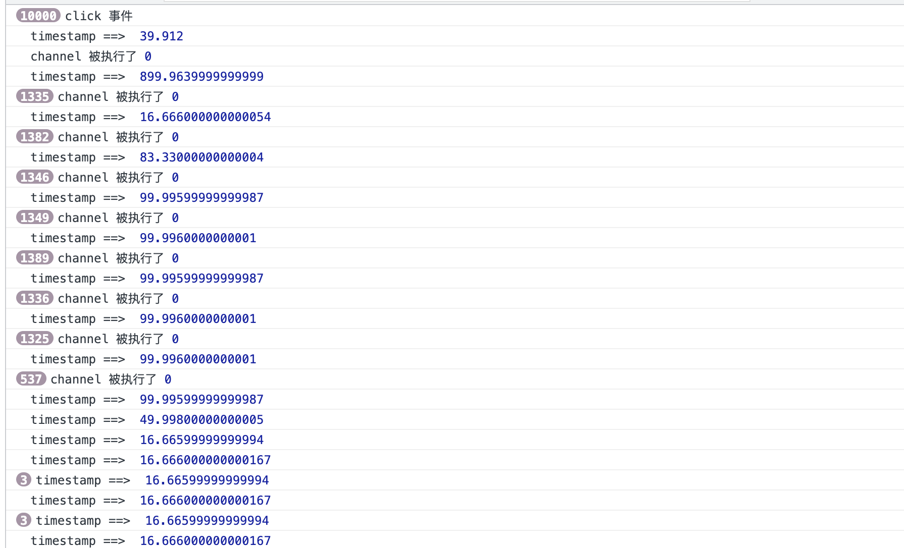
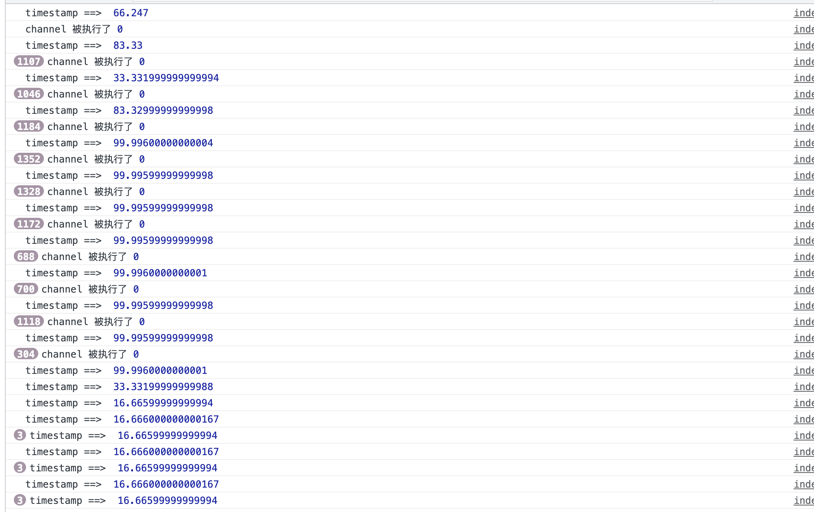

# 浏览器一帧里做了什么？

## 帧

 主流的屏幕刷新率都在 60Hz，那么渲染一帧的时间为 16.7ms。在这段时间内，浏览器需要完成如下事情：

- 脚本执行（JavaScript）：脚本造成了需要重绘的改动，比如增删 DOM、请求动画等
- 样式计算（CSS Object Model）：级联地生成每个节点的生效样式。
- 布局（Layout）：计算布局，执行渲染算法
- 重绘（Paint）：各层分别进行绘制（比如 3D 动画）
- 合成（Composite）：合成各层的渲染结果
 [https://harttle.land/2017/08/15/browser-render-frame.html](https://harttle.land/2017/08/15/browser-render-frame.html#)

## 一帧里事件执行顺序

在一帧里事件的执行顺序为：

- 用户事件
  - 阻塞输入事件，如`wheel`、`touch`等。
  - 非阻塞输入事件，如`click`、`keypress`等。
- 宏任务 + 微任务
  - 先执行宏任务。
  - 每个宏任务执行完后，会执行宏任务中产生的微任务。
  - 如果微任务中还有微任务，那么添加到微任务队列后，继续执行微任务。
  - 微任务执行完成后，可能会继续执行另一个宏任务（一帧里可以执行多个宏任务），也可能进入后续渲染阶段。
- begin frame
  - window.resize
  - scroll
  - mediaquery changed （媒体查询）
  - animation events （动画事件）
- requestAnimationFrame回调（在每次渲染之前执行，丢帧时不执行）
- 浏览器渲染过程
  - 样式计算
  - 布局
  - 重绘
  - 合成
- requestIdleCallback回调（空闲时间）

- [life of a frame](https://medium.com/@paul_irish/requestanimationframe-scheduling-for-nerds-9c57f7438ef4)


- [anatomy of a frame](https://aerotwist.com/blog/the-anatomy-of-a-frame/)


- [深入解析你不知道的 EventLoop 和浏览器渲染、帧动画、空闲回调（动图演示）](https://juejin.cn/post/6844904165462769678)
- [Vue源码详解之nextTick：MutationObserver只是浮云，microtask才是核心！](https://segmentfault.com/a/1190000008589736)


## 事件循环模拟代码

```javascript
<!DOCTYPE html>
<html lang="en">

<head>
  <meta charset="UTF-8">
  <meta http-equiv="X-UA-Compatible" content="IE=edge">
  <meta name="viewport" content="width=device-width, initial-scale=1.0">
  <title>事件循环模拟代码</title>
</head>

<body>
  <button id="btn" onclick="handle()">点击事件</button>

  <script>
    window.onload = () => {

      handle = () => {
        console.log('click 事件')
      }

      // click 事件
      const click = () => {
        const dom = document.getElementById('btn')
        dom && dom.click()
      }


   // 宏任务 message channel
      const channel = new MessageChannel()
      const port = channel.port2;
      channel.port1.onmessage = (message) => {
        console.log('channel 被执行了', message.data)
      }
      const postMessage = (num = 0) => {
        port.postMessage(num);
      };

      // 宏任务 timeout
      const timeout = (num = 0, delay = 0) => {
        setTimeout(function () {
          console.log(num)
        }, delay)
      }

      // 微任务
      const promise = (num = 0) => Promise.resolve(num).then(console.log('promise', num))
      
      // 帧动画 requestAnimationFrame
      let start = 0
      function animate(timestamp) {
        console.log('timestamp ==> ', timestamp - start);
        // idleCallback()
        start = timestamp
        if (start < 3000) {
          requestAnimationFrame(animate)
        }
      }
      requestAnimationFrame(animate)

      // 空闲时间
      const callback = (timestamp) => {
        console.log('requestIdleCallback', timestamp.timeRemaining())
      }
      const idleCallback = () => requestIdleCallback(callback)


      // 模拟
      for (let i = 0; i < 10000; i++) {
        click()
        postMessage()
        // timeout()
        // promise() 
      }

    }
  </script>
</body>

</html>
```

## 执行顺序

### 用户事件

#### 执行代码

```javascript
// 对比 click 和 channel
for (let i = 0; i < 10000; i++) {
   click()
   postMessage()
}
```

#### 执行结果



#### 结果分析

::: tip 用户事件
click 事件优先于 MessageChannel 事件，而且会执行 899ms，阻塞渲染。
:::

### 宏任务 - MessageChannel

#### 执行代码

```javascript
// channel
for (let i = 0; i < 10000; i++) {
   postMessage()
}
```

#### 执行结果



#### 结果分析

::: tip 宏任务 messageChannel
在一次渲染过程中，MessageChannel 可以被执行多次，并且 MessageChannel 最大执行时间为 100ms 左右，此时也会影响正常的渲染，但是不是特别明显。
:::

### 宏任务 - setTimeout

#### 执行代码

```javascript
for (let i = 0; i < 10000; i++) {
   timeout()
}
```

#### 执行结果


#### 结果分析

::: tip 宏任务 setTimeout
一次渲染中，setTimeout同样可以执行多次，但是基本不会影响正常渲染。MessageChannel 和 setTimeout 都是宏任务，通常来讲，MessageChannel 是优先于 setTimeout 执行的。但这也需要根据 setTimeout 设置的延迟时间相关。
:::

### 微任务 - Promise

#### 执行代码

```javascript
for (let i = 0; i < 10000; i++) {
   timeout()
   promise()
}
```

#### 执行结果


#### 结果分析

::: tip 微任务 promise
一次渲染中微任务会多次执行，并且直到执行完微任务才会开始渲染。这里微任务执行了 1316ms，阻塞了渲染。

并且微任务之后渲染之前，可能还会出现 宏任务+微任务。
:::

### 总结


## 思考

### vue $nextTick 为什么优先使用 promise 而不是 setTimeout？

从宏任务和微任务的关系可以知道，当执行`this.$nextTick`时处于宏任务阶段，而将其回调加入到微任务队列中。当前任务执行完成后，执行微任务，也就是`$nextTick`回调，最后执行渲染过程。这样就保证了在渲染之前，所有微任务（这里指`$nextTick`回调）都被执行。

如果使用`setTimeout`，此时`$nextTick`回调是宏任务，回调可能在当前帧执行，可能被推迟到下一帧执行。如果推迟到下一帧执行，此时会先进行当前帧渲染。然后在下一帧`$nextTick`回调，触发`Vue`更新再次渲染。例如
[宏任务下的Vue效果抖动明显](http://jsfiddle.net/v9q9L0hw/2/)
[微任务下的Vue效果相对稳定](https://jsfiddle.net/k6bgu2z6/4/)

### react 时间切片的实现

假设`react`整个更新过程的时间为160ms，那么这个过程中渲染会被阻塞，此时用户的输入等事件都无法被响应。那么该如何解决这个问题呢？答案是时间切片。

```javascript
`react`的整个更新过程的时间 = 所有节点内容的计算时间 + 将节点渲染到浏览器时间
```

`将节点渲染到浏览器时间`应该是一个完整体，必须一次性进行，否则，出现一点点渲染的问题，影响到用户体验。

其次是`节点相关内容的计算时间`，假设它耗时比较长，为150ms，那么我们可以把他拆分为单个节点的计算时间之和。单个节点的计算非常快，这里假设都为0.1ms。那么可以根据宏任务在帧中执行的特点（一帧里可以执行多个宏任务，同时浏览器还会将宏任务合理分配到不同帧中），将渲染过程改为如下过程：

``` javascript
// 在内存中进行
第1帧开始
  宏任务开始
    执行第1个节点，耗时0.1ms
    执行第2个节点，耗时0.1ms
    执行第3个节点，耗时0.1ms
    执行第4个节点，耗时0.1ms
    ...
    执行第50个节点，耗时0.1ms
    总耗时5ms，开始下一个宏任务
  
  渲染开始
    由于更新是在内存中计算的，节点没有任何更新，那么不进行重新渲染
第1帧结束

第2帧开始
  宏任务开始
    执行第51个节点，耗时0.1ms
    执行第52个节点，耗时0.1ms
    执行第53个节点，耗时0.1ms
    ...
    执行第100个节点，耗时0.1ms
    总耗时5ms，开始下一个宏任务
  
  渲染开始
    由于更新是在内存中计算的，节点没有任何更新，那么不进行重新渲染
第2帧结束

...

第n帧开始
  宏任务开始
    执行第m-2个节点，耗时0.1ms
    执行第m-1个节点，耗时0.1ms
    执行第m个节点，耗时0.1ms
    所有节点计算完毕！
    开始更新创建真实节点

  渲染开始
    真实节点更新，将其渲染到浏览器上
第n帧结束
```

通过上面的执行过程，我们可以把`react`渲染过程切分为一个个执行时间大约`5ms`的宏任务，同时这些宏任务又被合理分配到了每一帧中，不会阻塞其他任务的进行。所以如果还有其他比较重要的操作，比如点击事件，那么会在下一帧中直接执行。
