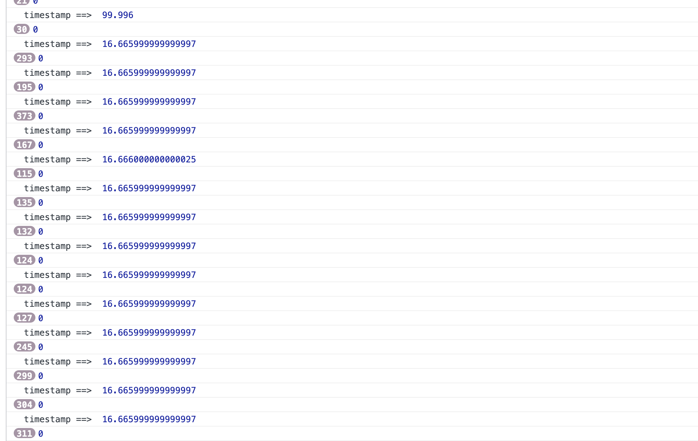

# 浏览器一帧里做了什么？

## 帧是什么？

https://harttle.land/2017/08/15/browser-render-frame.html

## 一帧里做了什么事？

https://medium.com/@paul_irish/requestanimationframe-scheduling-for-nerds-9c57f7438ef4


https://aerotwist.com/blog/the-anatomy-of-a-frame/


## 事件循环、浏览器渲染之间的关系。

https://juejin.cn/post/6844904165462769678

https://segmentfault.com/a/1190000008589736


## 事件循环模拟代码

```javascript
<!DOCTYPE html>
<html lang="en">

<head>
  <meta charset="UTF-8">
  <meta http-equiv="X-UA-Compatible" content="IE=edge">
  <meta name="viewport" content="width=device-width, initial-scale=1.0">
  <title>事件循环模拟代码</title>
</head>

<body>
  <button id="btn" onclick="handle()">点击事件</button>

  <script>
    window.onload = () => {

      handle = () => {
        console.log('click 事件')
      }

      // click 事件
      const click = () => {
        const dom = document.getElementById('btn')
        dom && dom.click()
      }


			// 宏任务 message channel
      const channel = new MessageChannel()
      const port = channel.port2;
      channel.port1.onmessage = (message) => {
        console.log('channel 被执行了', message.data)
      }
      const postMessage = (num = 0) => {
        port.postMessage(num);
      };

      // 宏任务 timeout
      const timeout = (num = 0, delay = 0) => {
        setTimeout(function () {
          console.log(num)
        }, delay)
      }

      // 微任务
      const promise = (num = 0) => Promise.resolve(num).then(console.log('promise', num))
      
      // 帧动画 requestAnimationFrame
      let start = 0
      function animate(timestamp) {
        console.log('timestamp ==> ', timestamp - start);
        // idleCallback()
        start = timestamp
        if (start < 3000) {
          requestAnimationFrame(animate)
        }
      }
      requestAnimationFrame(animate)

      // 空闲时间
      const callback = (timestamp) => {
        console.log('requestIdleCallback', timestamp.timeRemaining())
      }
      const idleCallback = () => requestIdleCallback(callback)


      // 模拟
      for (let i = 0; i < 10000; i++) {
        click()
        postMessage()
        // timeout()
        // promise() 
      }

    }
  </script>
</body>

</html>
```

## 执行顺序

### 用户事件

#### 执行代码：

```javascript
// 对比 click 和 channel
for (let i = 0; i < 10000; i++) {
   click()
   postMessage()
}
```

#### 执行结果：


#### 结果分析：

::: tip 用户事件
click 事件优先于 MessageChannel 事件，而且会执行 899ms，阻塞渲染。
:::

### 宏任务 - MessageChannel

#### 执行代码：

```javascript
// channel
for (let i = 0; i < 10000; i++) {
   postMessage()
}
```

#### 执行结果：


#### 结果分析

::: tip 宏任务 messageChannel
在一次渲染过程中，MessageChannel 可以被执行多次，并且 MessageChannel 最大执行时间为 100ms 左右，此时也会影响正常的渲染，但是不是特别明显。
:::

### 宏任务 - setTimeout

#### 执行代码:

```javascript
for (let i = 0; i < 10000; i++) {
   timeout()
}
```

#### 执行结果:



#### 结果分析：

::: tip 宏任务 setTimeout
一次渲染中，setTimeout同样可以执行多次，但是基本不会影响正常渲染。MessageChannel 和 setTimeout 都是宏任务，通常来讲，MessageChannel 是优先于 setTimeout 执行的。但这也需要根据 setTimeout 设置的延迟时间相关。
:::

### 微任务 - Promise

#### 执行代码：

```javascript
for (let i = 0; i < 10000; i++) {
   timeout()
   promise()
}
```

#### 执行结果：


#### 结果分析：

::: tip 微任务 promise
一次渲染中微任务会多次执行，并且直到执行完微任务才会开始渲染。这里微任务执行了 1316ms，阻塞了渲染。

并且微任务之后渲染之前，可能还会出现 宏任务+微任务。
:::

### 总结


## 时间切片

https://blog.csdn.net/weixin_42833042/article/details/109254120