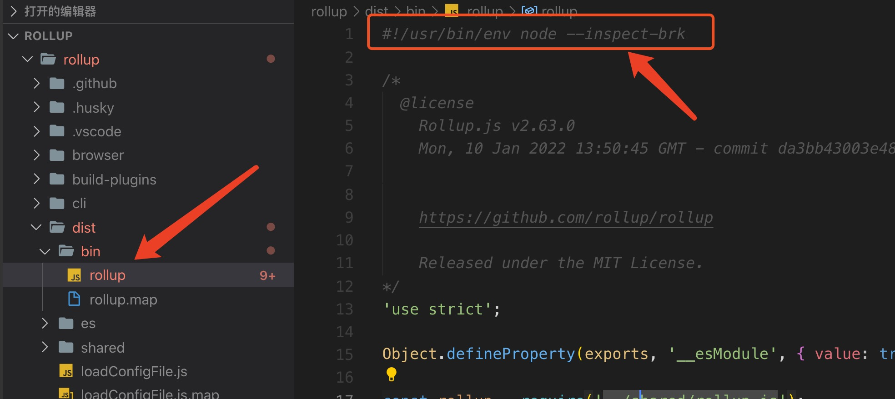
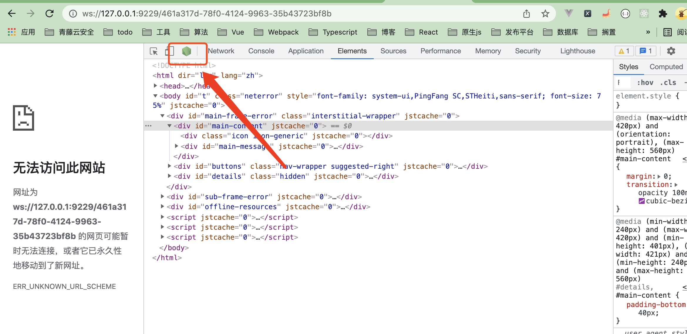
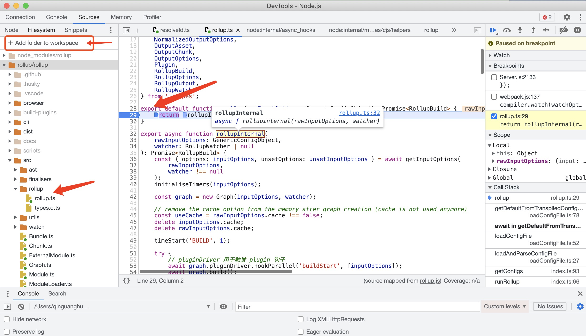

# 如何调试 rollup 源码？

## 1. 拉取代码
```bash
git clone https://github.com/rollup/rollup.git
```

## 2. 安装依赖
```bash
yarn
```
运行命令后会自动打包生成`dist`目录。

## 3. 添加--inspect-brk
在`rollup`目录中找到`dist/bin/rollup`文件，在第一行中添加`--inspect-brk`后缀。
```javascript
// 添加前
#!/usr/bin/env node
// 添加后
#!/usr/bin/env node --inspect-brk
```
如下所示：



## 4. 建立rollup软连接
在`rollup`目录中执行`yarn link`建立`rollup`的软连接。
```bash
cd rollup
yarn link
```

## 5. 使用rollup
新建一个工程目录，比如`study-rollup`（可以自己随意起名），然后链接`rollup`：
```bash
# 进入 study-rollup 目录
cd study-rollup
yarn link rollup
```

## 6. 运行
在终端中运行`rollup`命令（也可以在`package.json`的`scripts`中定义命令）。
```bash
# 进入 study-rollup 目录
cd study-rollup
rollup -c
```
运行后会出现一个`ws:`开头的`url`：


## 7. 浏览器调试
在浏览器中打开上一个步骤中的`url`，如：
```javascript
// 注意：每次运行时的地址不一样
ws://127.0.0.1:9229/012b3b38-94de-4d45-b899-f629917c52c7
```
打开`Chrome`控制台，会发现一个`node`的`logo`：



点击该`logo`，会弹出一个窗口，找到`Sources`选项，通过`Add folder to workspace`将我们前面下载好的`rollup`包导入进来，然后找到`rollup`的源码入口，打上断点，就可以调试了。




