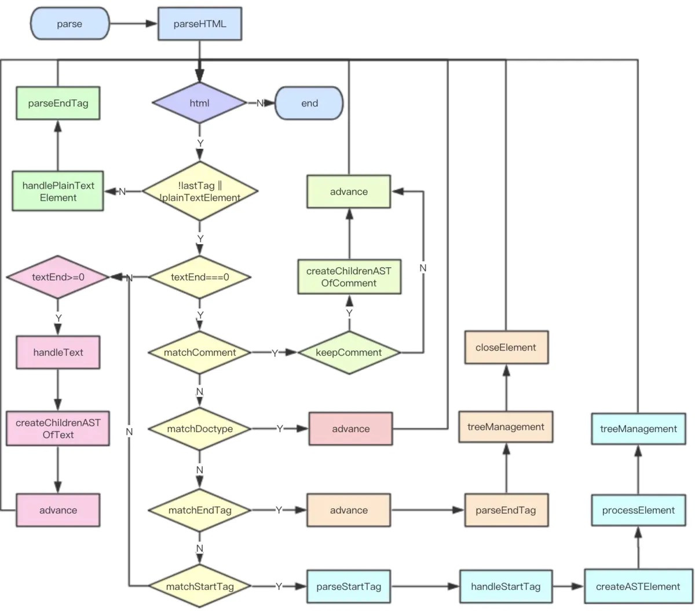

# 编译过程之parse方法

## 概览

在讲编译过程中的`parse`方法前，先上一张流程图：



（图片来自[这里](https://www.jianshu.com/p/51ceaa1d96d2)）

这张流程图完美地解释了`parse`方法的整个过程。中间部分`parse`=>`parseHTML`=>`html`=>`!lastTag ||...`一直往下是整个过程的主流程，而左右两侧则是`parse`过程中根据不同情况出现的不同分支。下面我们沿着主流程将整个`parse`过程过一遍源码，看看它是如何将`template`模板转换成抽象语法树的。

## parseHTML

整个`parse`相关的方法都是放在`src/compiler/parser`目录下的，打开`index.js`文件：

```javascript
export function parse (
  template: string,
  options: CompilerOptions
): ASTElement | void {
  ...
  parseHTML(template, {
    ...,
    start (tag, attrs, unary, start, end) {...},
    end (tag, start, end) {...},
    chars (text: string, start: number, end: number) {...},
    comment (text: string, start, end) {...}
  })
  return root
}
```

`parse`的核心实现是调用了`parseHTML`函数，且传入了`start,end,chars,comment`四个方法。在`./html-parser.js`文件中找到`parseHTML`：

```javascript
export function parseHTML (html, options) {
  // 存放解析的标签
  const stack = []
  // 默认为true
  const expectHTML = options.expectHTML
  // 是否为自闭标签
  const isUnaryTag = options.isUnaryTag || no
  // 是否为能半开标签
  const canBeLeftOpenTag = options.canBeLeftOpenTag || no
  let index = 0
  // * lastTag 为最后一次处理的结束标签
  let last, lastTag
  while (html) {
    last = html
    if (!lastTag || !isPlainTextElement(lastTag)) {
      let textEnd = html.indexOf('<')
      if (textEnd === 0) {
        if (comment.test(html)) {...}
        if (conditionalComment.test(html)) {...}
        ...
        if (doctypeMatch) {...}
        ...
        if (endTagMatch) {...}
        ...
        if (startTagMatch) {...}
      }
      if (textEnd >= 0) {...}

      if (textEnd < 0) {...}

      if (text) {...}

      if (options.chars && text) {...}
    } else {...}
  }
```

`parseHTML`先是定义了解析时需要的一些变量，然后通过`while`来循环解析`html`。首先我们先了解下前面定义的变量：

- 传入的`html`参数就是我们平时书写的`template`模板字符串。
- `stack`是用于存放解析完的标签。
- `isUnaryTag`用于判断标签是否是自闭和标签，如`,<input/>`等。
- `canBeLeftOpenTag`用于判断标签是否是可半开标签，如末尾的`p`标签等。
- `letlast`存储着最后一次解析的标签。

了解完这个之后，我们再看看具体是怎么解析`html`的。首先是判断`!lastTag||!isPlainTextElement(lastTag)`是否为`true`，如果为`false`，代表`lastTag`既存在又是`script/style/textarea`标签中的一种，需要另做处理。这里我们主要讲解为`true`的情况，此时会执行如下代码：

```javascript
let textEnd = html.indexOf('<')
```

在`html`字符串中找到第一个`<`符号，如果`<`位于第一个位置，那么它有几种可能：

- `comment.test(html)`为`true`代表可能是注释标签。需要判断是否有`-->`结尾才能肯定是否是注释标签。
- `conditionalComment.test(html)`为`true`代表可能是浏览器兼容判断相关的标签。需要判断是否有`]>`结尾才能肯定是否是注释标签。

- `doctypeMatch`为`true`代表是`<!DOCTYPE>`标签。

以上三者都是一些比较特殊的标签，基本都会通过`advance`方法跳过这些标签：

```javascript
function advance (n) {
  index += n
  html = html.substring(n)
}
```

而`advance`的作用就是每解析一段`html`代码就将解析完的截取掉，然后通过`while`循环解析剩下的`html`代码。


紧接着，剩下的就只有两种其他的标签，一种是开始标签如`<div`，一种是结束标签如`</div>`。

```javascript
if (endTagMatch) {...}
...
if (startTagMatch) {...}
...
```

他们分别对应两个方法：`parseStartTag`和`parseEndTag`

## options.start

`parseStartTag`主要做了两件事：**第一件事是解析出开始标签名称**；**第二件事是解析出开始标签的属性**。这里以一个模板为例子：

```javascript
<div v-if="isShow" class="header">编译过程</div>
```

这个模板经过`parseStartTag`的时候，会先通过正则匹配解析出开始标签：`["<div","div"]`

```javascript
const start = html.match(startTagOpen)
// ["<div","div"]
```

然后通过`while`循环匹配属性，解析出所有的属性：

```javascript
while (!(end = html.match(startTagClose)) && (attr = html.match(dynamicArgAttribute) || html.match(attribute))) {
  attr.start = index
  advance(attr[0].length)
  attr.end = index
  match.attrs.push(attr)
}
```

最后得到的`match`为：

```json
{
  "tagName": "div",
  "attrs": [
    [" v-if=\"isShow\"", "v-if", "=", "isShow", null, null],
    [" class=\"header\"", "class", "=", "header", null, null]
  ],
  "start": 0
}
```

解析完成后，会使用`handleStartTag`进一步处理标签：

```javascript
 function handleStartTag (match) {
  	...
    for (let i = 0; i < l; i++) {
 			...
      attrs[i] = {
        name: args[1],
        value: decodeAttr(value, shouldDecodeNewlines)
      }
    }
		...
    if (options.start) {
      options.start(tagName, attrs, unary, match.start, match.end)
    }
  }
```

这里主要是对上一步骤解析处理的属性进一步处理，得到的`attrs`如下：

```javascript
// 处理前
[
  [' v-if="isShow"', 'v-if', '=', 'isShow', null, null],
  [' class="header"', 'class', '=', 'header', null, null]
]

// 处理后
[
  { name: 'v-if', value: 'isShow', start: 5, end: 18 },
  { name: 'class', value: 'header', start: 19, end: 33 }
]
```

可以看出，处理后的属性更加直观，同时也更方便我们去处理。

接着调用了`start`方法：

```javascript
options.start(tagName, attrs, unary, match.start, match.end)
```

这个方法是我们在`parse`函数里传给`parseHTML`的，所以回到`index.js`文件中，找到`start`方法。由于该方法较长，这里仅按照它的主要处理步骤进行讲解。

### 1.创建AST树

```javascript
let element: ASTElement = createASTElement(tag, attrs, currentParent)
```

通过我们解析到的标签名称和属性来创建一个语法树节点：

```json
{
  type: 1,
  tag,
  attrsList: attrs,
  attrsMap: makeAttrsMap(attrs),
  rawAttrsMap: {},
  parent,
  children: []
}
```

### 2.处理特殊标签

```javascript
for (let i = 0; i < preTransforms.length; i++) {
  element = preTransforms[i](element, options) || element
}
```

这里的`preTransforms`是在`/platforms/web/compiler/modules/model`文件中定义的，主要是处理`input`标签为`radio/checkbox`等特殊情况。

### 3.处理`Vue`相关的属性

```javascript
processPre(element)
platformIsPreTag(element.tag)
processRawAttrs(element)
processFor(element)
processIf(element)
processOnce(element)
```

将`v-pre/v-if/v-for/v-once`等指令都进行了相应的处理，如下表对照所示：

| 方法        | 模板中处理前的属性           | 处理后的属性                                                 |
| ----------- | ---------------------------- | ------------------------------------------------------------ |
| processPre  | v-pre                        | el.pre = true                                                |
| processFor  | v-for="(item, index) in arr" | el.for = "arr"<br />el.alias = "item"<br />el.iterator1 = "index"<br />el.iterator2 = undefined (遍历对象的时候存在) |
| processIf   | v-if="isShow"                | el.if="isShow"<br />el.ifConditions=[{ exp:"isShow" , block: el}] |
| processIf   | v-else                       | el.else=true                                                 |
| processIf   | v-else-if="isElse"           | el.elseif="isElse"                                           |
| processOnce | v-once                       | el.once=true                                                 |

由于处理的过程代码比较多，而且也没有多大的难度，所以这里将最终的处理结果直接进行展示。

### 4.建立父子关系

```javascript
if (!unary) {
  currentParent = element
  stack.push(element)
} else {
  // * 如果是单标签，需要闭合标签
  closeElement(element)
}
```

如果是单标签的话，就直接走结束标签的流程，否则**将当前开始标签置为currentParent，并压入栈中**。这里压入栈中的步骤比较关键，后面分析结束标签的时候会提起。

这样`parseStartTag`这个流程就走完了，我们得到了一个已经处理完属性的`ast`节点，并且这个节点就是`currentParent`。接下来我们继续分析。

## options.chars

还是以刚刚的模板为例：

```javascript
<div v-if="isShow" class="header">编译过程</div>
```

由于开始标签接下完成了，那么会调用`advance`方法，截取开始标签，因此`html`只会剩下以下内容了：

```javascript
编译过程</div>
```

此时会继续执行`while`循环，最后通过判断得出当前走到了文本内容，会执行以下方法：

```javascript
// text 代表的就是上方的 “编译过程” 字符串
options.chars(text, index - text.length, index)
```

这个`chars`同样是在`parse`方法里传入的。

```javascript
if (!inVPre && text !== ' ' && (res = parseText(text, delimiters))) {
  child = {
    type: 2,
    expression: res.expression,
    tokens: res.tokens,
    text
  }
} else if (text !== ' ' || !children.length || children[children.length - 1].text !== ' ') {
  child = {
    type: 3,
    text
  }
}

const children = currentParent.children
children.push(child)
```

这里主要是分为两种情况，一种是文本里有动态数据的，比如我们文本里有`\{\{ msg \}\}`定义的数据，那么就会通过`parseText`解析出相应的`tokens`。否则直接按静态文本处理。最后将文本添加到`currentParent.children`中。

## options.end

解析完文本后，`html`就只剩下`</div>`了，此时`while`循环会走`parseEndTag`方法：

```javascript
for (pos = stack.length - 1; pos >= 0; pos--) {
  if (stack[pos].lowerCasedTag === lowerCasedTagName) {
    break
  }
}
```

该方法主要的目的就是通过当前结束标签去找起始标签。起始标签我们都存在一个栈里了，举个例子：

```javascript
<h1><div></div></h1>
```

以上标签在解析时，先解析`h1`起始标签，压入到栈中为`[h1起始标签]`。然后解析到`div`起始标签，压入到栈中为`[h1起始标签, div起始标签]`。继续解析发现是`div`结束标签，这个时候就要去栈中找相匹配的标签了。找到`div`起始标签，那么证明这两者就是一个完整的标签内容，形成一个完整的`ast`节点。然后将`div`起始标签弹出栈，栈就只剩下`[h1起始标签]`了。最后，解析到`h1`结束标签，重复上述步骤，匹配到`h1`起始标签，将`h1`起始标签弹出栈。此时栈已经空了，也完成了所有的解析，最终就形成`ast`树了。

所以这里的`parseEndTag`方法的目的就是为了去找起始标签，找到后就会执行`end`方法：

```javascript
options.end(stack[i].tag, start, end)

// end 方法
end (tag, start, end) {
  const element = stack[stack.length - 1]
  stack.length -= 1
  currentParent = stack[stack.length - 1]
  closeElement(element)
}
```

这里的思路和上面举的例子一样，匹配完成后将起始标签弹出栈，最后执行`closeElement`来处理整个标签：

```javascript
function closeElement(element) {
  if (!inVPre && !element.processed) {
    element = processElement(element, options)
  }
  ...
}
```

我们主要讨论`closeElement`里的`processElement`方法:

```javascript
processKey(element)
element.plain =
  !element.key && !element.scopedSlots && !element.attrsList.length
// el.ref = ref, el.refInFor = 检查是否在 for 循环中
processRef(element)
// 解析类似父组件中使用 slot 的情况
// el.slot el.slotTarget el.slotTargetDynamic el.scopedSlots
processSlotContent(element)
// 解析 slot 标签
processSlotOutlet(element)
// :is => el.component / inlineTemplate => el.inlineTemplate
processComponent(element)
for (let i = 0; i < transforms.length; i++) {
  element = transforms[i](element, options) || element
}
```

这里和之前提到的`processFor`等方法类似，我们也用一个对照表来进行说明：

| 方法               | 模板中处理前的属性                       | 处理后的属性                                                 |
| ------------------ | ---------------------------------------- | ------------------------------------------------------------ |
| processKey         | :key="id"                                | el.key="id"                                                  |
| processRef         | :ref="id"                                | el.ref="id"el.refInFor=当前节点是否在for循环内               |
| processSlotContent | v-slot:default="scope"                   | el.slotTarget="default"<br />el.slotTargetDynamic=动态绑定的名称<br />el.slotScope=scope<br />el.children=只有在组件上使用才有children |
| processSlotOutlet  | \<slot name="header">\</slot>              | el.slotName="header"                                         |
| processComponent   | \<component :is="Com">\</component>        | el.component="Com"                                           |
| processComponent   | \<component inline-template">\</component> | el.inlineTemplate=true                                       |
| processAttrs       | @click:foo.bar="onClick"                 | 这里处理比较复杂，主要是将其他的属性和事件进行处理           |

## 最后

到这里，`parse`方法的大致过程就已经过了一遍了。**其主要思想就是遍历html的字符，然后进行匹配，将所有匹配到的开始标签压入栈中。当匹配到结束标签时，从栈中找到最近的相匹配的标签，将其弹出栈，然后形成一个完整的ast节点。当遍历完成时，所有的节点就会形成一棵语法树（ast）。**

当然，这里介绍的可能不是很详细，其实最好的学习方法还是自己亲自多调试几遍源码，调试多了流程就自然明白了。所以这里算是抛砖引玉，比如还有`parseText`，`parseFilter`等方法都没有讲解，如果感兴趣的话也可以都调试一下。

