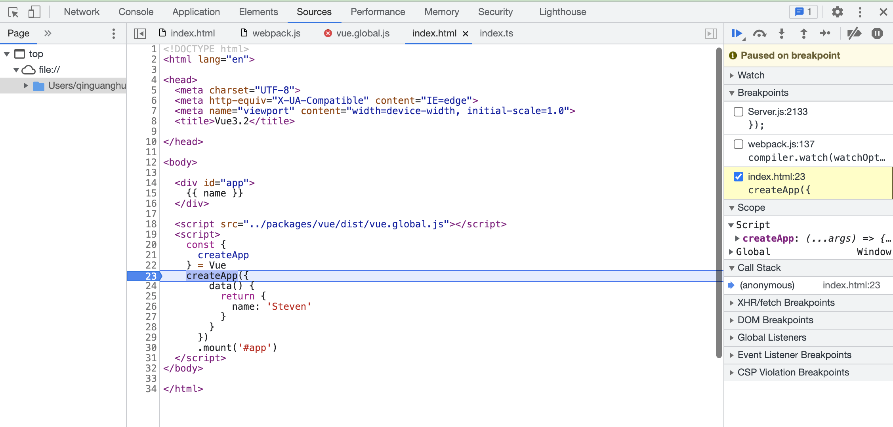

# 源码调试

## 1. 拉取Vue3源码
[Vue3源码 github地址](https://github.com/vuejs/vue-next)
```bash
git clone https://github.com/vuejs/vue-next.git
```

## 2. 安装依赖
```bash
yarn
```

## 3. 移除 git 相关内容
找到`scripts/dev.js`文件，注释`git`相关代码：
```javascript
// const commit = execa.sync('git', ['rev-parse', 'HEAD']).stdout.slice(0, 7)

...

// `COMMIT:${commit}`,
```

## 4. 修改配置
修改`package.json`文件中的`dev`配置：
``` javascript
"dev": "node scripts/dev.js"
改为
"dev": "node scripts/dev.js --sourcemap"
```

## 5. 编译
运行`dev`命令：
```bash
yarn run dev
```
会在`packages/vue/dist`目录下生成两个文件：
```javascript
vue.global.js
vue.global.js.map
```

## 6. 引用编译好的代码
建立一个`html`文件，引入编译好的代码，例如：
```html
<!DOCTYPE html>
<html lang="en">
<head>
  <meta charset="UTF-8">
  <meta http-equiv="X-UA-Compatible" content="IE=edge">
  <meta name="viewport" content="width=device-width, initial-scale=1.0">
  <title>Vue3.2</title>
</head>
<body>

  <div id="app">
    {{ name }}
  </div>

  <script src="../packages/vue/dist/vue.global.js"></script>
  <script>
    const { createApp } = Vue;

    createApp({
        data() {
          return {
            name: 'Silence'
          }
        }
      })
      .mount('#app')
  </script>
</body>
</html>
```

## 7. 调试
在浏览器中打开该`html`文件，即可在`source`中调试代码：




