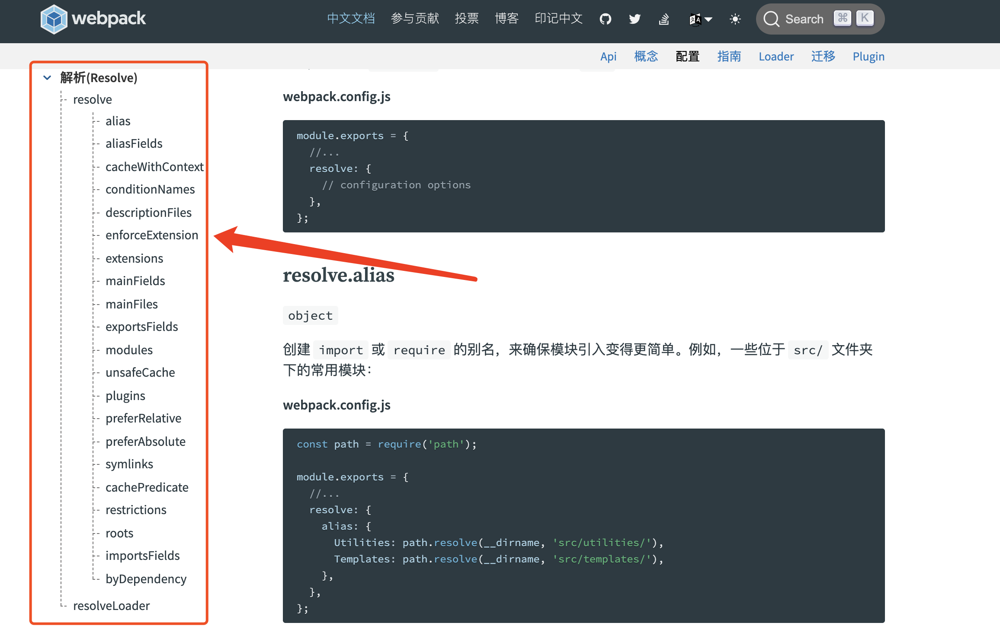

# factorizeModule

`make`阶段第一步做的事是通过`factorizeModule`将`dependency`创建成相应的`module`。

## _factorizeModule方法

找到`_factorizeModule`方法的定义：

```javascript
_factorizeModule({ factory }) {
  factory.create(
    {
      // ...
    },
    (err, result) => {
      // ...
    }
  );
}
```

该方法实际上调用的是`factory`方法。`factory`方法是一个工厂函数，用于创建`module`。这里以`NormalModuleFactory`为例。找到`webpack/lib/NormalModuleFactory.js`文件中`create`方法的定义，该方法最终会走到`hooks.factorize`:

```javascript
this.hooks.factorize.callAsync(resolveData, (err, module) => {})
```

而在`NormalModuleFactory`的`constructor`中正好定义了`factorize.tapAsync`，并会执行`hooks.resolve.callAsync()`，进入到`resolve`的回调函数。回调函数内主要由两段逻辑，一段是对`dependency`进行`resolve`，另一段逻辑是处理`loader`。

## getResolver

在`resolve`之前，会先获取处理`dependency`的`resolver`：

```javascript
const normalResolver = this.getResolver(
  "normal",
  dependencyType
  ? cachedSetProperty(
    resolveOptions || EMPTY_RESOLVE_OPTIONS,
    "dependencyType",
    dependencyType
  )
  : resolveOptions
);


getResolver(type, resolveOptions) {
  return this.resolverFactory.get(type, resolveOptions);
}
```

`resolverFactory`在`compiler`对象初始化时就已经实例化。找到`webpack/lib/ResolverFactory.js`，调用`get`方法时如果缓存中没有`resolver`，就会调用`_create`方法创建一个`resolver`。

```javascript
_create(type, resolveOptionsWithDepType) {
  const resolver = /** @type {ResolverWithOptions} */ (Factory.createResolver(
    resolveOptions
  ));
  // ...
  return resolver;
};
```

## createResolver

找到`node_modules/enhanced-resolve/lib/ResolverFactory.js`文件，里面定义了`createResolver`方法。该方法在实例化`Resolver`后，定义了一系列的钩子，用于整个`dependency`的`resolve`过程。

```javascript
resolver.ensureHook("resolve");
resolver.ensureHook("internalResolve");
resolver.ensureHook("newInteralResolve");
resolver.ensureHook("parsedResolve");
resolver.ensureHook("describedResolve");
resolver.ensureHook("internal");
resolver.ensureHook("rawModule");
resolver.ensureHook("module");
resolver.ensureHook("resolveAsModule");
resolver.ensureHook("undescribedResolveInPackage");
resolver.ensureHook("resolveInPackage");
resolver.ensureHook("resolveInExistingDirectory");
resolver.ensureHook("relative");
resolver.ensureHook("describedRelative");
resolver.ensureHook("directory");
resolver.ensureHook("undescribedExistingDirectory");
resolver.ensureHook("existingDirectory");
resolver.ensureHook("undescribedRawFile");
resolver.ensureHook("rawFile");
resolver.ensureHook("file");
resolver.ensureHook("finalFile");
resolver.ensureHook("existingFile");
resolver.ensureHook("resolved");
```

同时，后面还在对应的钩子上应用了一些插件用于`resolve`。比如：

```javascript
// 处理 resolve 缓存
plugins.push(
  new UnsafeCachePlugin(
    source,
    cachePredicate,
    unsafeCache,
    cacheWithContext,
    `new-${source}`
  )
);

// 处理 路径
plugins.push(
  new ParsePlugin(`new-${source}`, resolveOptions, "parsed-resolve")
);

// 处理 描述文件
plugins.push(
  new DescriptionFilePlugin(
    "parsed-resolve",
    descriptionFiles,
    false,
    "described-resolve"
  )
);

// 处理 别名
if (alias.length > 0) {
  plugins.push(new AliasPlugin("normal-resolve", alias, "internal-resolve"));
}

// 等等其他插件...
```

这些插件正好对应了`webpack`中的`resolve`配置：[webpack resolve 配置](https://webpack.docschina.org/configuration/resolve/)



## resolver.resolve

获取完`resolver`后会调用`resolver.resolve`解析`dependency`，包括文件引用路径解析（比如是绝对路径还是相对路径还是模块，有哪些参数等等），文件路径查找，文件描述文件读取，文件别名替换等等操作。

## loader 匹配

解析完当前`dependency`之后进入到回调函数，这里调用的是`continueCallback`方法。

```javascript
const result = this.ruleSet.exec({
  resource: resourceDataForRules.path,
  realResource: resourceData.path,
  resourceQuery: resourceDataForRules.query,
  resourceFragment: resourceDataForRules.fragment,
  mimetype: matchResourceData ? "" : resourceData.data.mimetype || "",
  dependency: dependencyType,
  descriptionData: matchResourceData
  ? undefined
  : resourceData.data.descriptionFileData,
  issuer: contextInfo.issuer,
  compiler: contextInfo.compiler,
  issuerLayer: contextInfo.issuerLayer || ""
});
```

该方法会对`dependency`和`loader`的配置进行匹配，返回该`dependency`使用到的`loaders`。随后使用`loaderResolver`对每个`loader`进行文件解析，返回`loader`的文件路径。

```javascript
this.resolveRequestArray(
  contextInfo,
  this.context,
  useLoadersPost,
  loaderResolver,
  resolveContext,
  (err, result) => {
    postLoaders = result;
    continueCallback(err);
  }
);
```

## createModule

当`dependency`解析完成后，执行`resolve`回调：

```javascript
this.hooks.factorize.tapAsync(
  {
    name: "NormalModuleFactory",
    stage: 100
  },
  (resolveData, callback) => {
    this.hooks.resolve.callAsync(resolveData, (err, result) => {
      this.hooks.afterResolve.callAsync(resolveData, (err, result) => {
        const createData = resolveData.createData;
        this.hooks.createModule.callAsync(
          createData,
          resolveData,
          (err, createdModule) => {
            if (!createdModule) {
              createdModule = new NormalModule(createData);
            }

            createdModule = this.hooks.module.call(
              createdModule,
              createData,
              resolveData
            );

            return callback(null, createdModule);
          }
        );
      });
    });
  }
);
```

最终会通过`createdModule = new NormalModule(createData)`创建一个`module`，并将该`module`作为回调函数的参数传递给下一阶段，也就是`addModule`阶段。

## 总结

`factorizeModule`调用`xxxModuleFactory.create`方法将`dependency`转化成`module`。

在这个过程中会实例化`resolver`，通过不同的`resolver`对`dependency`进行解析，包括文件路径，文件描述，文件别名等等进行解析。

解析完成后与配置的`loader`匹配规则进行匹配。如果与该`dependency`匹配成功，那么会使用`loaderResolver`解析`loader`文件路径，存放到`createData.loaders`当中。

最后根据解析好的`createData`创建一个`module`。